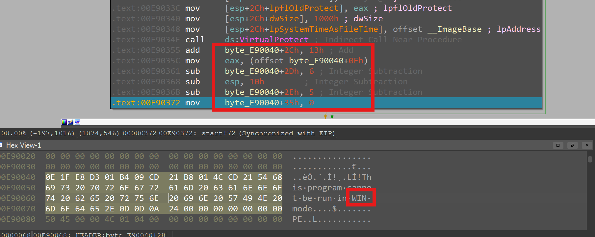
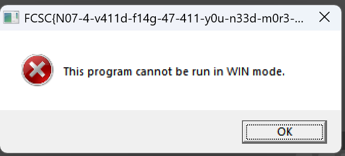
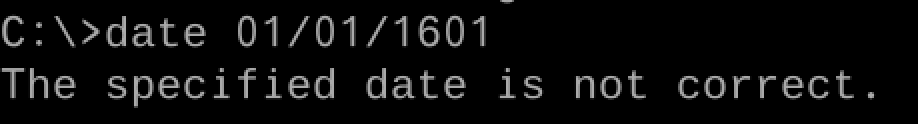
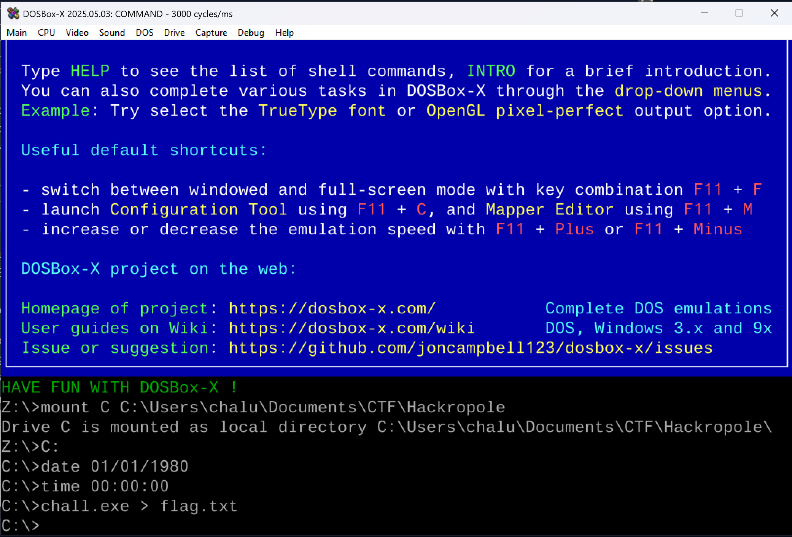

# À temps tôt
 Write-up 

Challenge Source: [Hackropole À temps tôt](https://hackropole.fr/fr/challenges/reverse/fcsc2024-reverse-a-temps-tot/)


# Solution

Opening the binary in IDA, we find only one function.

Looking at the imports, the only function present is [GetSystemTimeAsFileTime](https://learn.microsoft.com/en-us/windows/win32/api/sysinfoapi/nf-sysinfoapi-getsystemtimeasfiletime). This function retrieves the current system date and time in Coordinated Universal Time (UTC).


A ``FILETIME`` structure is made up of:

- dwLowDateTime: The low-order part of the file time.

- dwHighDateTime: The high-order part of the file time.

Which are the date and time of the PC.

Together, they store the date and time as a 64-bit counter of 100-nanosecond intervals since January 1, 1601 UTC.

In the disassembly, the two parts are combined with an OR operation, followed by a jnz (jump if not zero). This means the program will only take the “success” path if both high and low parts are zero — which corresponds to exactly January 1, 1601, 00:00 UTC.

While debugging in IDA and using **SetIP**, we noticed the DOS header bytes changing from **DOS** to **WIN**:


The program then displayed the error:



Searching for this exact message led to a [PlaidCTF 2017](https://0xd13a.github.io/ctfs/pctf2017/reversing-hole/) write-up, where the author used DOSBox to run their binary.

### Attempt with DOSBox

In standard DOSBox, the date and time commands are not functional for changing the system clock. Searching further, I found a [GitHub issue](https://github.com/joncampbell123/dosbox-x/issues/989) about DOSBox-X, a fork that supports date/time changes.

After installing [DOSBox-X](https://github.com/joncampbell123/dosbox-x/releases/tag/dosbox-x-v2025.05.03), I tried setting the required date, but got:




This happens because most PC BIOSes — and the FAT file system — do not support dates earlier than 1980-01-01.


Inside dosbox-x.conf, I added the following lines to the [autoexec] section:


````
mount C C:\Users\xx\Documents\
C:
date 01/01/1980
time 00:00:00
chall.exe > flag.txt
````


Running the challenge with this configuration produced the flag:



````
└─$ cat FLAG.TXT
FCSC{D4735-4r3-d1ff1cu17-70-und3r574nd-15n7-17?}
````


✅ **Answer**: FCSCFCSC{D4735-4r3-d1ff1cu17-70-und3r574nd-15n7-17?}