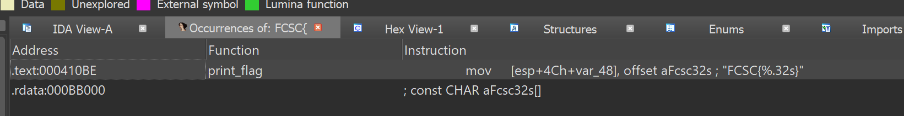
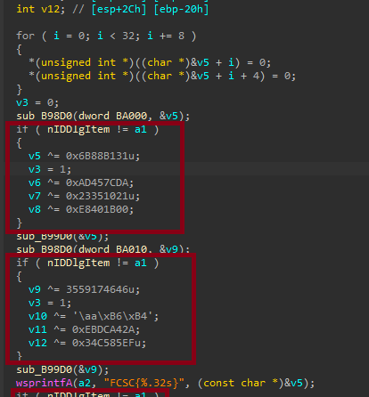
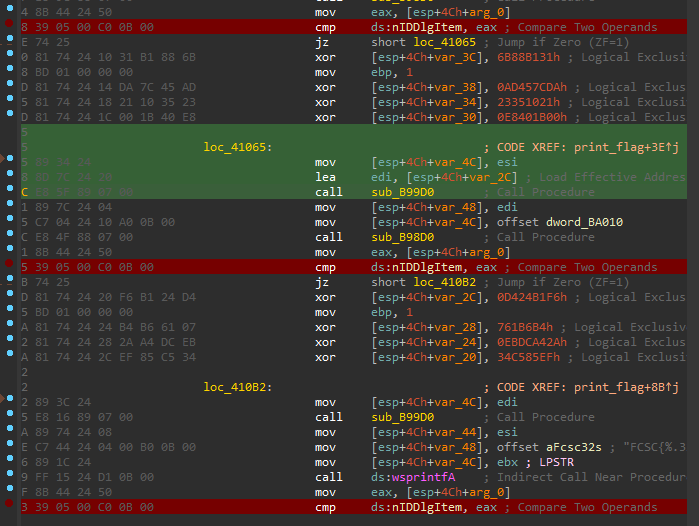
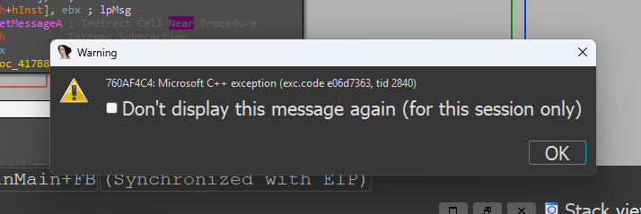
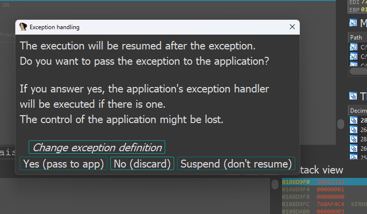
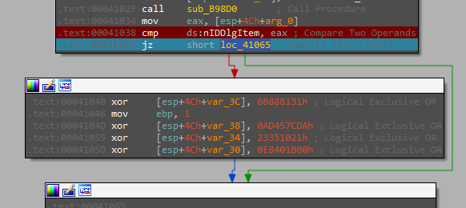
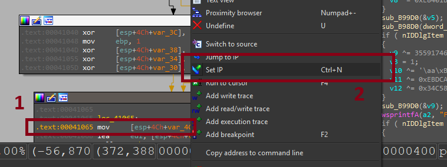
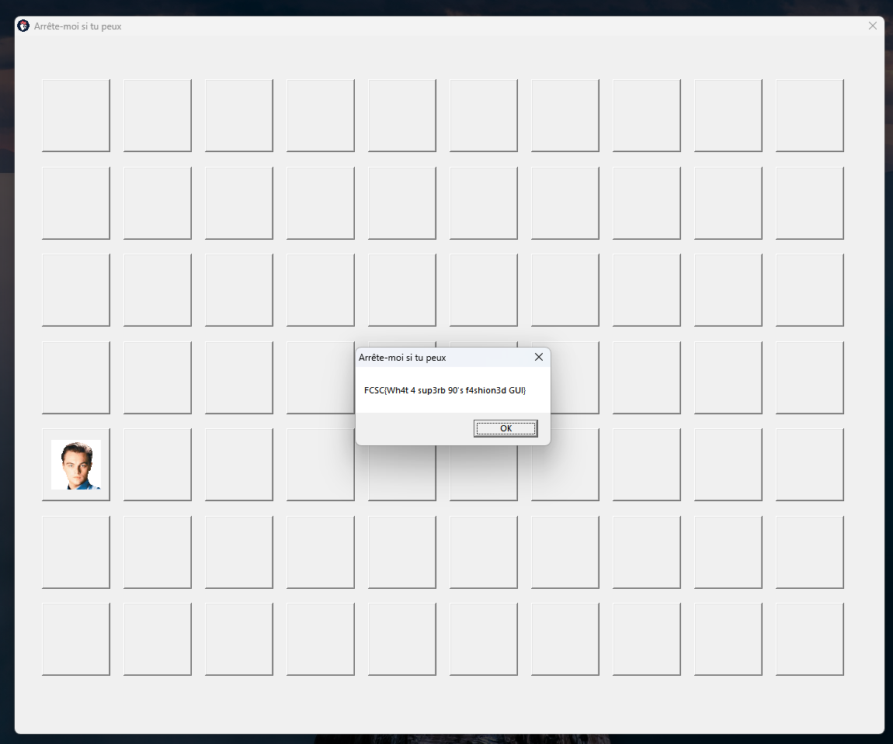

# 🎯  Catch me if you can Write-up 

Challenge Source: [Hackropole Catch me if you can](https://hackropole.fr/fr/challenges/reverse/fcsc2025-reverse-catch-me-if-you-can/) 

# TDLR

- Found "FCSC{" in binary to locate the flag function
- Identified anti-debug and comparison checks
- Set breakpoints before critical checks
- Skipped bad branches using Set IP
- Flag is revealed in a message box (and register)

# Solution

We start by analyzing the binary file provided:

````sh
└─$ file CATCHME.EXE
CATCHME.EXE: PE32 executable (GUI) Intel 80386 (stripped to external PDB), for MS Windows, 7 sections
````
This tells us it’s a 32-bit Windows GUI application, compiled for Intel x86 architecture. The binary is stripped.

I will use IDA to decompile the challenge, reverse it and debug it.

## 🔍 Step 1: Locate the Flag Function

After loading the binary into IDA, I search for the string "FCSC{", which is likely part of the final flag format.

This search leads us to a specific function (renamed for clarity to print_flag) located at: ``.text:000410BE``	


This is a strong indicator that the function is responsible for showing the flag.

## 🧩 Step 2: Understand the Flag Check Conditions

When analyzing the ``print_flag`` function, we notice a critical condition (happening three times):

```C
if (nIDDlgItem != a1) {
   // Do something that corrupts or prevents the flag
}
```



This means if a particular dialog item ID (nIDDlgItem) doesn't match a1, the program will take a "bad path" and possibly scramble the flag.

🧠 Conclusion: We need to bypass or force this check to always succeed.

## ⛔ Step 3: Set Breakpoints to Bypass Anti-Debugging Logic

To bypass the unwanted logic:

1. We set breakpoints before each comparison that checks critical values like nIDDlgItem or other runtime state.

2. In the debugger, we can manually change the instruction pointer to skip the wrong branches.



Additionally, there’s an anti-debugging trick involving GetTickCount(). Set another breakpoint right after the call to GetTickCount().

## ⚙ Step 4: Run the Program and Interact Properly

1. Switch the debugger to "Local Windows Debugger" in IDA.

2. Start the program. And wait for it to charge. Continue the process until the ``ShowWindow`` funciton

3. Once the app window appears, click the window once to continue GUI interaction (important for continuing execution flow).

4. The app may show two errors with options — click “OK” and then “Yes, pass to the app” for both:





## 🔁 Step 5: Force Correct Execution Path

Once you're near the key comparison logic, do the following:

Set the instruction pointer (Set IP) to address: ``.text:0041065`` for the first one. Do the same for the others






## 🏁 Final Step: View the Flag

If done correctly, the program will reach the ``MessageBoxA`` function that displays the flag:



Note: The flag will appear into the register too

✅ **Answer**: FCSC{Wh4t 4 sup3rb 90's f4shion3d GUI}
